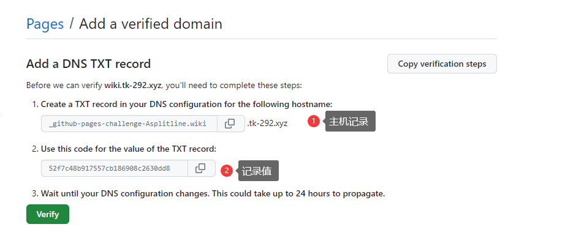

# 部署实战

## 部署 nextjs 项目

项目放置地址: `/data`

nginx 配置文件：`/etc/nginx/conf.d/test_project_nginx.conf`

```nginx
server {
  listen       8011;
  server_name  12.12.12.12; # 需配置为对应服务器端口
  index index.html;
  gzip             on;
  gzip_min_length  1000;
  gzip_proxied     expired no-cache no-store private auth;
  gzip_types       text/plain application/x-javascript text/html text/css application/xml application/octet-stream;
location / {
    proxy_pass  http://127.0.0.1:3011;
    proxy_set_header Host $proxy_host;
    proxy_set_header X-Real-IP $remote_addr;
    proxy_set_header X-Forwarded-For $proxy_add_x_forwarded_for;
  }
}
```

> 注意：12.12.12.12 - 改为对应服务端口

pm2 配置文件路径： `/etc/nginx/conf.d/ecosystem.config.js`

参数说明

- name ： pm2 名称
- script：命令
- args：命令参数
- cwd：项目根目录

```javascript
module.exports = {
  apps: [
    {
      name: 'test_project',
      script: 'node_modules/next/dist/bin/next',
      args: 'start -p 3012',
      max_memory_restart: '1024M',
      cwd: '/data/test_project', // 根目录
      instances: 1,
      error_file: './logs/error.log',
      out_file: './logs/out.log',
      log_date_format: 'YYYY-MM-DD HH:mm Z',
      watch: false,
      ignore_watch: ['node_modules']
    }
  ]
}
```

> ecosystem.config.js 为固定名称

启动方式 ： `pm2 start ecosystem.config.js`

### 相关链接

pm2 官网：[https://pm2.keymetrics.io/](https://pm2.keymetrics.io/)

## 自动化部署 vitepress

### 配置 Repository secrets

port 端口默认 22


### 配置 workflows

`.github/workflows/main.yml`

```yaml
# This workflow will do a clean installation of node dependencies, cache/restore them, build the source code and run tests across different versions of node
# For more information see: https://help.github.com/actions/language-and-framework-guides/using-nodejs-with-github-actions

name: tk-notes-ci/cd

on:
  push:
    branches: [master]
#  pull_request:
#   branches: [master]

jobs:
  build:
    runs-on: ubuntu-latest

    strategy:
      matrix:
        node-version: [16.x]
    steps:
      # download source
      - name: Checkout
        uses: actions/checkout@master

      # Install & Build
      - name: Build
        uses: actions/setup-node@master
      - run: |
          yarn install
          yarn build

      # copy dist
      - name: Upload
        uses: appleboy/scp-action@master
        with:
          host: ${{ secrets.HOST }}
          username: ${{ secrets.USERNAME }}
          password: ${{ secrets.PASSWORD }}
          port: ${{ secrets.PORT }}
          source: './docs/.vitepress/dist/*'
          target: '/data/tk-notes'
          strip_components: 3 # 去掉 3 层路径, /data/tk-notes/docs/.vitepress/dist/* => /data/tk-notes/*


      # run source
      # - name: Deploy
      #   uses: appleboy/ssh-action@master
      #   with:
      #     host: ${{ secrets.HOST }}
      #     username: ${{ secrets.USERNAME }}
      #     password: ${{ secrets.PASSWORD }}
      #     port: ${{ secrets.PORT }}
      #     script: |
      #       cd /data/tk-notes
      #       yarn install
      #       yarn build
      #       pm2 start yarn --name tk-docs -- serve
```

### 相关链接

[GitHub Actions 入门教程](http://www.ruanyifeng.com/blog/2019/09/getting-started-with-github-actions.html)

[appleboy/scp-action@master](https://github.com/marketplace/actions/scp-command-to-transfer-files)

## vitepress 部署到 Github Pages

> 以下例子均以 https://github.com/Asplitline/wiki-template 为例

### 第一步：生成 token

生成 token，用于后面 git action 操作

步骤：`setting -> Developer settings -> Tokens (classic) -> Generate new token -> Generate new token (classic)`。


按顺序操作后，会进入生成 token 页面。

expiration：到期时间。怕麻烦直接选无期限（不建议）。

Select scopes：token 所具有权限。至少选择 `repo` 和 `workflow`，其他看情况。


### 第二步：使用 token

生成后将 token 复制对应仓库（`wiki-template`）下面

步骤：`Settings -> Actions -> New repository secret`


新建 `WIKI_TOKEN` ，并将第一步生成的 token 复制到此处。

> WIKI_TOKEN，名称随意，但要和后面 deploy.yml 中对应。


### 第三步：在项目中新建部署配置

配置 `deploy.yml` (`.github\workflows\deploy.yml`) 。

```yml
name: Deploy

on:
  push:
    branches:
      - master

jobs:
  deploy:
    runs-on: ubuntu-latest
    steps:
      - uses: actions/checkout@v3
        with:
          fetch-depth: 0
      - uses: actions/setup-node@v3
        with:
          node-version: 16
          cache: yarn
      - run: yarn install --frozen-lockfile

      - name: Build
        run: yarn build

      - name: Deploy
        uses: peaceiris/actions-gh-pages@v3
        with:
          github_token: ${{ secrets.WIKI_TOKEN }}
          publish_dir: docs/.vitepress/dist
```

配置完成后 推送 `master` 分支代码到仓库。出现 gh-pages 分支，说明没问题。


### 第四步：开启 git pages

> 注意：私有项目需要付费才能开启

步骤：`Settings -> Pages -> Branch 切换为 gh-pages`


成功后通过 https://asplitline.github.io/wiki-template/ 进行访问。

### 第五步：配置域名

> 没有域名，这部可以略过。

为了简化流程：申请域名申请，审核流程。

以腾讯云为例：**我们需要添加两条记录：`TXT` 和 `CNAME`**

`域名注册 -> 我的域名 -> 找到对应域名（tk-292.xyz）进行解析操作`


#### 添加 `CNAME` 记录值

主机记录：此处填的 `wiki`，是一个二级域名，也可填写 `www`。但无论填什么，都要与后续步骤对应上

记录类型：选择 `CNAME`

记录值：为 github 用户名加上 github.io。如：我 github 用户名为 asplitline，所以填 `asplitline.github.io`

#### 添加 `TXT` 记录值

添加 `TXT` 记录值，首先需要获取 `TXT` 相关信息，请按照以下操作获取。

`Settings -> Pages -> Add a domain`




按上图进行操作后，将获得所需 主机记录 和 记录值

主机记录：`_github-pages-challenge-Asplitline.wiki`

记录类型：选择 `TXT`

记录值：`52f7c48b917557cb186908c2630dd8`

验证通过后如下图


#### 添加域名解析

回到项目下，将域名填入 `Custom domain`


解析无错后，可以通过 https://wiki.tk-292.xyz/ 进行访问。

> 建议勾选 Enfore HTTPS 选项

#### 域名丢失问题

`custom domain` 值在每次部署会丢失，需要重新填写。

两种方法：添加 `CNAME` 文件 或者 `在 deploy.yml` 新增 `cname` 字段 

方法一：添加 CNAME 文件：在 `public` 目录下(`docs/public/CNAME`)下添加 `CNAME` 文件，内容如下

```
wiki.tk-292.xyz
```

方法二：`在 deploy.yml` 新增 `cname` 字段 

```yml
	 	# ...
        with:
          github_token: ${{ secrets.WIKI_TOKEN }}
          publish_dir: docs/.vitepress/dist
          cname: wiki.tk-292.xyz # if wanna deploy to custom domain
```


## vitepress 添加 algolia search

https://docsearch.algolia.com/
