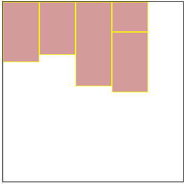

# CSS

Cascading Style Sheets （层叠样式表）

## 引入

**内部样式**：控制一个页面 （**权重最高**）

```html
<style type="text/css">
  /* 样式 */
</style>
```

**行内样式**：控制一个标签

```html
<div style="color:red;"></div>
```

**外部样式**：控制整个站点

```html
<!-- 1.使用标签关联 -->
<head>
  <link rel="stylesheet" type="text/css" href="css文件路径" />
</head>
<!-- 2.使用指令关联 -->
<style type="text/css">
  @import url('css文件路径');
</style>
```

**优先级**：行内 > 外部样式 > 默认样式

## css 基础属性

### 字体属性

- **字体大小** - `font-size`：数字 + 像素单位(px)
- **字体粗细** - `font-weight`
  - `normal`：正常（400）
  - `bold`：加粗（700）
  - `bolder`：(900)
- **字体风格** - `font-style`
  - `normal`：正常（默认）
  - `italic`：倾斜
- **字体类型** - `font-family`：宋体，微软雅黑，黑体等
  - 多组用**逗号**隔开
  - 空格 # $ 特殊字符 中文，需要**添加引号**

```css
/* font: font-style  font-weight  font-size/line-height  font-family */
font: italic bolder 30px/100px '微软雅黑';
```

> `font-size`和`font-family`**必写**，其余选写

### 文本属性

**文本修饰** - `text-decoration`

- `underline`：下划线
- `overline`：上划线
- `line-through`：删除线
- `none`：无

**文本转换** - `text-transform`

- `uppercase`：转大写
- `lowercase`：转小写
- `capitalize`：首字母大写

**文本对齐方式** - `text-align`

- `left`：左对齐**（默认）**
- `center`：居中对齐
- `right`：右对齐

**首行缩进** - `text-indent`

- 取值：px 或 em

### css 尺寸和行高

#### 尺寸

**宽度**：`width`：值

**高度**：`height`：值

- 单位 px 或 em

> **div 不设高度，默认为 0**

#### 行高

文字与文字之间的上下距离 `line-height`：值

_行高 = 上距离 + 内容高度 + 下距离_

_TIPS_ **标签文字垂直居中**，标签的高度和行高


### 背景属性

`background-color`

- 有效的颜色名称 - 比如 `red`
- 十六进制值 - 比如 `#ff0000`
- RGB 值 - 比如 `rgb(255,0,0)`

> `opacity` 属性为背景添加透明度，所有*子元素都继承*相同的透明度

**背景颜色**：`background-color`：颜色值

**背景图片**：`background-image`：url(图片路径)

**背景图片平铺**：`background-repeat`：值

- `no-repeat`：不平铺
- `repeat-x`：横向平铺
- `repeat-y`：纵向平铺

> 默认横纵都平铺

**背景图片位置**：`background-position`:水平位置，垂直位置

- `top left bottom right center`
- `x y`（单位 px）

只有一个值为`center`，水平垂直为`center`

只有一个值为`top left bottom right`，另一个方向默认为`center`

**背景缩放**：`background-size`:宽度 高度

- 单位 ：长度 / 百分比 / 特殊值
- 特殊值
  - `cover` - 背景扩展足够大，**完全覆盖**
  - `contain` - 扩展为最大尺寸，**高度或宽度适应**

> 只写一个参数，参数为高度

\*TIPS**\*背景图填充**：center top

```css
html,
body {
  height: 100%;
}
body {
  background: url(img/vivo-bg.jpg) no-repeat center top;
  background-size: cover;
}
```

**背景受滚动条的影响**`background-attachment`：值

- `scroll`：当内容滚动到下方，图片会消失（**默认**）
- `fixed`：图片一直保持在视线范围内
- `inherit`：从父级继承

**图片定位参考**：`background-origin`

- `padding-box`：相对内边距定位
- `border-box`：相对边框定位
- `content-box`：相对内容框定位

**背景的绘制区域**：`background-clip`

- `padding-box`：裁剪到内边距框
- `border-box`：裁剪到边框
- `content-box`：裁剪到内容框

**背景透明**：`background:rgba()` ，取值 0-1

**background 简写**

```css
/* background: 背景颜色 背景图片地址 背景平铺 背景滚动 背景位置 背景大小; */
background: transparent url(image.jpg) repeat-y scroll center top;
```

**_`img` 和 `backgroud-image`区别_**

**img**

- 图片**能撑开**盒子
- 移动位置用 padding margin

**backgroud-image**

- **撑不开**容器的 需要专门写宽高
- 移动位置 background-position

### 列表属性

**列表前缀样式**：`list-style-type:none`

**列表前缀自定义图片**：`list-style-image:url(图片路径)`

> ul 去掉自定义样式

```css
ul {
  list-style: none;
  padding: 0;
  margin: 0;
}
```

## css 选择器

### 基本选择器

|            |    基本选择器     |   例子   |                  |
| :--------: | :---------------: | :------: | ---------------- |
| 元素选择器 |     `element`     |   p{}    |                  |
| id 选择器  |       `#id`       |  #id{}   |                  |
|  类选择器  |     `.class`      | .class{} |                  |
| 分组选择器 | `element,element` |  div, p  | 选中多个元素     |
| 通配选择器 |        `*`        |    \*    | 选择**所有**元素 |

> id 选择器：用于选择唯一元素（元素 id 唯一）

### 常用选择器

|   常用选择器   |       选择器        | 说明               | 例子    |                                    |
| :------------: | :-----------------: | ------------------ | ------- | ---------------------------------- |
|   后代选择器   |  `element element`  | 选择**所有**子元素 | div p   | div 元素内的所有 p 元素            |
|  子元素选择器  | `element > element` | 选择**直接**子元素 | div > p | 父元素是 div 的**所有** p 元素     |
| 相邻元素选择器 | `element + element` | 选择**相邻**元素   | div + p | **紧跟** div 元素的**首个** p 元素 |
|   兄弟选择器   | `element ~ element` | 选择**兄弟**元素   | p ~ ul  | **前面**有 p 的**每个**ul 元素     |

### 属性选择器

|      属性选择器      | 说明                             |               例子               |
| :------------------: | -------------------------------- | :------------------------------: | ----------- |
|    `[attribute]`     | 带有**指定属性**的元素           |             [target]             |
| `[attribute=value]`  | 带有**指定属性并且值相同**的元素 |         [target=_blank]          |
| `[attribute~=value]` | **包含**指定词汇的元素           |         [title~=flower]          |
|     `[attribute      | =value]`                         | 选取属性值**以指定值开头**的元素 | [lang\|=en] |
| `[attribute^=value]` | 以**指定值开头**的元素           |         a[href^="https"]         |
| `[attribute$=value]` | 以**指定值结尾**的元素           |         a[href$=".pdf"]          |
| `[attribute*=value]` | **包含指定值**的元素             |       a[href*="w3schools"]       |
| `[attribute$=value]` | 以**指定值结尾**的每个元素       |        div[class$="test"]        |

`[attribute~=value]` ：**值为整个单词**

_有效_：`test` `second`
_无效_：`tes`

```html
<div class="first_test">第一个 div 元素。</div>
<div class="second">第二个 div 元素。</div>
<div class="test">第三个 div 元素。</div>
```

`[attribute | =value]`：**该值必须是整个单词，或者后面跟着连字符**

_有效_：`top`、`content`
_无效_：`to` `top-` `header` `con`

```html
<h1 class="top-header">Welcome</h1>
<p class="content">Are you learning CSS?</p>
```

> `[attribute*=value]` 包含固定字符即可
>
> `[attribute^=value]` 固定字符开头即可

### [伪类](https://developer.mozilla.org/zh-CN/docs/Web/CSS/Pseudo-classes)

伪类用于定义**元素的特殊状态**

| 伪类       | 说明                            |
| ---------- | ------------------------------- |
| `:link`    | 链接默认状态                    |
| `:visited` | 点击后状态                      |
| `:hover`   | 鼠标悬停状态                    |
| `:active`  | 鼠标按下状态                    |
| `:focus`   | 选取获得焦点的元素 （表单元素） |

`visited`和`link`不能适用于普通标签，只有 a 标签才有

> 考虑 CSS 权重问题，将一般的放在上面，将特殊的放在下面，focus 在 hover 和 active 之间
>
> 按照`lv f ha`顺序 - love hate

**其他伪类**

| 伪类                   | 例子                      | 说明                                                     |
| ---------------------- | ------------------------- | -------------------------------------------------------- |
| `:root`                | root                      | 选择元素的**根元素**                                     |
| `:not(selector)`       | :not(p)                   | 选择每个**非 `<p>` 元素**的元素                          |
| `:empty`               | p:empty                   | 选择**没有子元素**的每个 `<p>` 元素                      |
|                        |                           |                                                          |
| `:first-child`         | p:first-child             | 父节点下第一个元素且为`<p>`元素                          |
| `:first-of-type`       | p:first-of-type           | 父节点下第一个 `<p>`元素                                 |
| `:nth-child(n)`        | p:nth-child(2)            | 父节点下第二个元素且为`<p>`标签                          |
| `:nth-of-type(n)`      | p:nth-of-type(2)          | 父节点下第二个 `<p>`元素                                 |
| `:last-child`          | p:last-child              | 与 first 类似，从后往前                                  |
| `:last-of-type`        | p:last-of-type            | 与 first 类似，从后往前                                  |
| `:nth-last-child(n)`   | p:nth-last-child(2)       | 与 first 类似，从后往前                                  |
| `:nth-last-of-type(n)` | p:nth-last-of-type(2)     | 父节点下倒数第二个`<p>`元素                              |
| `:only-child`          | p:only-child              | 父节点仅有一个元素且为`<p>`元素，支持嵌套                |
| `:only-of-type`        | p:only-of-type            | 父节点下唯一`<p>`元素，支持嵌套                          |
| **input**              |                           |                                                          |
| `:checked`             | input:checked             | **被选中** `<input/>` 元素                               |
| `:disabled`            | input:disabled            | **被禁用** `<input/>` 元素                               |
| `:enabled`             | input:enabled             | **已启用**`<input/>` 元素（默认）                        |
| `:in-range`            | input:in-range            | 值在**范围内**的`<input/>`元素                           |
| `:out-of-range`        | input:out-of-range        | 值在**范围外**的`<input/>`元素                           |
| `:invalid`             | input:invalid             | **具有无效值**的 `<input/>` 元素                         |
| `:valid`               | input:valid               | **具有有效值**的 `<input/>` 元素                         |
| `:read-only`           | input:read-only           | **带 "readonly"** `<input/>` 元素                        |
| `:read-write`          | input:read-write          | **不带 "readonly"** `<input/>` 元素                      |
| `:required`            | input:required            | **带 "required"** `<input/>` 元素                        |
| `:optional`            | input:optional            | **不带 "required"** `<input/>` 元素                      |
|                        |                           |                                                          |
| **other**              |                           |                                                          |
| `:lang(language)`      | p:lang(it)                | lang 属性以`it`开头的元素（eg：lang=“it” lang=“it-ha”）  |
| `:target`              | p:target<br />#new:target | 选择瞄点定位后的`<p>`元素<br />herf=“#new”锚点定位后元素 |

**nth-child 扩展**

- 2n - 偶数
- 2n+1 - 奇数
- 5n - 5 10 15
- n+5 - 从第 5 个开始
- -n+5 - 前 5 个
- **n 从 0 开始，但是大于 0 才有效**

```css
/* 一行四个item */
.item {
  width: 190px;
  height: 190px;
  background-color: pink;
  /* 每行前三个 */
  &:not(:nth-child(4n)) {
    margin-right: 20px;
  }
  /* 第二行开始 */
  &:nth-child(n + 5) {
    margin-top: 40px;
  }
  /* 从第二个到第五个 */
  &:nth-child(n + 2):nth-child(-n + 5) {
    background-color: red;
  }
}
```

> ==n 要写在前面==

### [伪元素](https://developer.mozilla.org/zh-CN/docs/Web/CSS/Pseudo-elements)

CSS 伪元素用于设置**元素指定部分的样式**

一个选择器中只能使用一个伪元素。伪元素必须紧跟在语句中的简单选择器/基础选择器之后

| 伪元素           | 例子                   | 说明                                         |
| ---------------- | ---------------------- | -------------------------------------------- |
| `::after`        | p::after               | `<p>` 元素**之后**插入内容                   |
| `::before`       | p::before              | `<p>` 元素**之前**插入内容                   |
| `::first-letter` | p::first-letter        | 每个 `<p>` 元素的**首字母**                  |
| `::first-line`   | p::first-line          | 每个 `<p>` 元素的**首行**                    |
| `::placeholder`  | input::placehold**er** | **带 "placeholder"** 属性的 `<input />` 元素 |
| `::selection`    | p::selection           | 选择用户**选择的元素部分**                   |

> `::first-letter` `::first-line` 只适用于块级

## css 特性

### 样式的继承和覆盖

**覆盖**（层叠）：相同样式，后面覆盖前面。

> 选择器相同，后面覆盖前面。选择器不同，看优先级。

**继承**：父标签设置了样式，子标签都会具有父标签的样式

- **font-，text-，color，line- 能继承**
- **div 不能继承高度，可以继承宽度**
- 子标签和父标签设置相同 css，会覆盖父标签样式

### 样式优先级

**样式分类**：`行内样式>内部=外部`，内部样式和外部样式权重主要看顺序。

**样式优先级**：`伪类首字>伪类首行>!important>id名>类名=属性>标签名>通配`

**样式叠加**：`!important(无穷大) 行内样式(1000) id(100) class(10) 标签(1)`

> 每一级满 10 也不会往前进 1 10 class 权重小于 1 id

### 修改样式三步走

看标签是否选中

- 选中，计算权重，谁大选谁
- 没选择，权重为 0（因为继承权重为 0）

> 计算权重：**关键看是不是直接修饰的目标标签**

## 标签显示模式

### 块元素

- 宽度：100%（默认），会继承父级宽度
- 高度：0（默认）
- 换行显示，宽高均可设置

```
div、h1-h6、p、pre、ul、ol、li、form、table
```

**p 标签不能放任何块级元素**，但可以存放含 `display:block` 元素

```html
<p><p></p></p>
<!-- 上面结构会自动转为下面结构 -->
<p></p>
<p></p>
```

h1-h6、dt 里面不能放其他块级元素

### 行元素

- 宽度：内容宽度（默认）
- 高度：0（默认）
- 一行显示，**不能设置宽高**

```
a、strong、b、em、i、del、s、ins、u、span、label、img
```

### 行内块元素

- 宽度：内容宽度（默认）
- 高度：0（默认）
- 单行显示，能设置宽高

默认**宽度为内容宽度**，能设置宽和高，不能换行显示

```
img、input、td
```

### display

`display:值`

- **block**：块元素
- **inline**：行元素
- **inline-block**：行内块元素
- **none**：隐藏元素 （不占空间）

> 浮动后元素特性：类似 inline-block。（浮动脱标，inline-block 不脱标）

## 盒子模型

### padding - 内边距

padding 值**会增加盒子宽或高**

- 1 值-上下左右
- 2 值-上下 左右
- 3 值-上 左右 下
- 4 值-上 右 下 左 （顺时针）

**默认撑开盒子，但是如果没有宽度或继承的宽度，padding 不会撑开盒子**

```html
<div>
  <p></p>
</div>
```

```css
div {
  width: 300px;
  height: 100px;
  background-color: purple;
}
div p {
  /* width: 100%;*/
  padding: 30px;
  background-color: skyblue;
}
```

注释 width：100%，宽度等于父级宽度

解开 width：100%，宽度等于父级宽度+60px

### margin - 内边距

**块级盒子居中**

- 有宽度，左右为 auto
- 无宽度，默认为 100%，不存在居中

```css
/*写法1*/
margin: 0 auto;
/*写法2*/
margin: auto;
/*写法3*/
margin-left: auto; /*左侧充满*/
margin-right: auto; /*右侧充满*/
/* 根据剩余长度居中对齐 */
```

> **行内元素尽量只设置 左右边距**

### 边框属性

边框会增加盒子宽高

**边框类型**：`border-style`

- **solid**：实线
- **dashed**：虚线
- **dotted**：点线
- **double**：双线

**边框颜色**：`border-color`

**边框厚度**：`border-width`

**简写**：`border:宽度 类型 颜色`

**边框圆角**：`border-radius:值`

- 左上角 右上角 右下角 左下角 (顺时针)
- border-top、border-right、border-bottom、border-left

**去边框**：`border：none`

**细线表格**：`border-collapse:collapse;`

- 合并相邻边框
- 表格和单元格都加边框属性

> 块级盒子没有 width（包含继承），添加 padding 和 border 不会撑大盒子

### 盒子模型的 bug

**1.盒子上下摆放，上盒子有下外边距，下盒子有上外边距，两个边距会重合，以大的边距为准**


**解决**：间距给到一个元素上

**2.两个盒子嵌套关系，两个盒子对于上外边距会重合，以大的边距为准**


**解决**：

- 外部盒子：添加**border-top**
- 外部盒子：添加**padding-top**
- 外部盒子：添加**oveflow:hidden**

### 盒子模型布局稳定性

**width > padding > margin**

- width：需手动计算
- padding：盒子撑大
- margin：垂直外边距合并

### margin 负值

**水平垂直居中**：负边距+定位

```css
.inner-box {
  width: 100px;
  height: 100px;
  background-color: #666;
  position: absolute;
  top: 50%;
  left: 50%;
  margin-left: -50px;
  margin-top: -50px;
}
```

> 很少使用，通常 `transform:translate(-50%,-50%)`

**压住盒子相邻边**

场景：由于设置`border`，4 个盒子总宽度 (200+2)\*4，所以末尾盒子背挤向下一排

解决：设置 `margin-left:-2px`

原理：第 1 个 item 向前移动 2px，第 2 个 item 由于浮动先贴紧，然后再向左移动 2px，以此类推，第 4 个 item，在原来基础上向左移动 8px。

```css
.list {
  margin-top: 20px;
  margin-left: 20px;
  box-sizing: content-box;
  width: 800px;
  height: 500px;
  background-color: #888;
}
.item {
  box-sizing: content-box;
  margin-left: -2px;
  float: left;
  border: 1px solid #ccc;
  width: 200px;
  height: 200px;
  background-color: #999;
}
.item:hover {
  position: relative;
  border-color: tomato;
}
```

## 布局

标准流（底层）- 浮动流（中间）- 定位（顶层）

> 海底 - 地面 - 天空

### **标准流**

按照标签默认的特性摆放盒子

- 块级元素，从上向下
- 行内元素，从左到右，边缘换行

### **浮动流**

`float:left/right/none`

- 脱离标准流，浮在标准流上面（**不占位置**）
- 任何元素都可浮动
- 浮动后生成块级框（类似行内块），**不换行，能设置宽高**
- 设置浮动的元素，**居中不起作用**

#### 浮动元素重叠

- 行内元素与浮动元素发生重叠，边框、背景、内容都会显示在浮动元素之上

- 块级元素与浮动元素发生重叠，边框、背景在浮动元素之下，**内容在浮动元素之上**

#### 浮动元素位置

浮动元素换行

大盒子放不下了，浮动元素会掉下去，**随前面元素高度变化**

- 前一个元素 `>` 前两个元素，到第一个元素下方
- 前一个元素 `<` 前两个元素，到前一个元素下方
- 前一个元素 `=` 前两个元素，向前移，比较前二



##### 浮动元素和父盒子

- 参照父盒子对齐
- 不会与边框重叠，也不会超过内边距

##### 浮动元素和兄弟盒子

- 前一个盒子浮动，当前盒子和前一个**顶部对齐**
- 前一个盒子标准流
  - 行元素，浮动元素显示在前面
  - 块元素，浮动元素显示在下面

> 浮动只**会影响当前或者后面标准流盒子**，不会影响前面

**应用**

- 盒子水平排列
- 盒子左右对齐
- 文字环绕图片

> 盒子水平排列：可以用 inline-block，但盒子间空隙不方便处理

#### 浮动问题

**浮动在父盒子不占位置，无法撑开父盒子**（高度为 0），影响之后元素


#### 清除浮动

**清除浮动脱标的影响**（对之后元素）

1. 父元素设置高度 (不推荐，高度一般可变)
2. **额外标签法(隔墙法)**：在浮动元素末尾添加一个空的标签

```css
<div class='clear' > </div > .clear {
  clear: both;
}
```

> 添加无意义标签，结构化差

3. **父级添加 overflow 属性** `overflow:auto`

- hidden 溢出全部隐藏
- auto 溢出产生滚动条

缺陷：内容溢出后，会隐藏元素

4. after 伪元素(**推荐**)

```css
.clearfix:after {
  content: '\200B';
  display: block;
  height: 0;
  clear: both;
  visibility: hidden;
}

.clearfix {
  *zoom: 1;
} /* IE6、7 专有 */
```

> \200B - 零宽度空格，也可用 `.` ，可以不写
>
> block - 块级显示，宽度填充
>
> height - 避免破坏原有布局
>
> clear:both - 清除浮动
>
> hidden - 隐藏元素（占位）

> \*zoom - 由于 IE6-7 不支持:after，使用 zoom:1 触发 hasLayout

5. **使用双伪元素清除浮动(推荐)**

```css
.clearfix:before,
.clearfix:after {
  content: '';
  display: table;
}

.clearfix:after {
  clear: both;
}
.clearfix {
  *zoom: 1;
}
```

> table - 创建匿名单元格触发 bfc

### 定位流

**将盒子定位在某一位置**，让多个盒子前后叠压来显示

#### 静态定位

`position:static`

所有标准流都是静态定位

应用：将定位后元素还原成标准流

#### 相对定位

`position：relative`

**相对于自身标准流的位置**进行定位

- 出发点：**自身标准流**的位置
- 自身在标准流中**还占有空间**
- **可以盖在标准流的上方**


#### 绝对定位

`position:absolute`

**脱离标准流**进行定位

- **偏移参考**：设置过定位（相对/绝对/固定）的**直系父元素或直系祖先**。一直未找到，参考最顶层 html

- **会脱离标准流**，不占空间，内容决定宽高，可定义宽高
- `margin：auto` 失效

如果父级（祖先）没有定位则**相对于 html**，以下为父级有定位


应用：**父相子绝**

父级相对定位，保证元素占位，子级通过绝对定位，不占位显示

#### 固定定位

**浏览器作为参考进行偏移**，且滚动条对固定定位无效

`position:fixed`

- **会脱离标准流**，不占空间，内容决定宽高，可定义宽高
- `margin：auto`失效
- **不随滚动条滚动**，永远固定在**浏览器窗口**中的位置

### 定位元素层叠效果

`z-index`：控制定位元素的**叠放层级**

- 数字
  - 正数，越大，层级越高 `>auto`
  - 负数，越小，层级越低 `<auto`
- auto（默认）：与父元素同级

> 层级越高，越靠近用户

**特性**：

- z-index 只针对**定位**（相对/绝对/固定）元素有效果
- **父元素比较过层级**（均有`z-index`值，且不为`auto`），==子元素不会再比较==
- **`auto`比正数小**

### 总结

| 定位模式 | 是否脱标占有位置     | 边偏移 | 移动位置基准                 |
| -------- | -------------------- | ------ | ---------------------------- |
| static   | 不脱标，正常模式     | 不可以 | 正常模式                     |
| relative | 不脱标，占有位置     | 可以   | **相对于自身**位置移动       |
| absolute | 完全脱标，不占有位置 | 可以   | **相对于定位的父级**移动位置 |
| fixed    | 完全脱标，不占有位置 | 可以   | **相对于浏览器**移动位置     |

> 定位（相对/绝对/固定）元素不会**触发外边距合并**的问题
