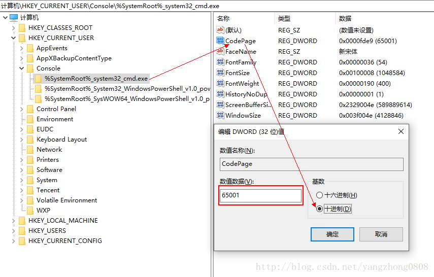

# 其他

## 微软输入法卡顿

删除 `C:\Users\用户名\AppData\Roaming\Microsoft\InputMethod\Chs` 中 Chs

## window cmd 修改默认字符集

1、win+r 打开运行窗口

2、输入 regedit 打开注册表编辑器

3、定位到 HKEY_CURRENT_USER\Console\%SystemRoot%\_system32_cmd.exe

4、修改其中 Codepage 选项，勾选十进制，windows 默认是 936

437（英语）

65001（utf-8）

936（GBK）

参考 ： https://blog.csdn.net/yangzhong0808/article/details/79012628
