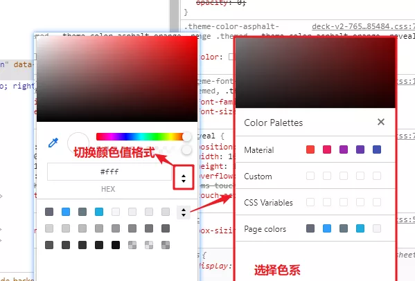

# Chrome devtool

**Chromium**：是谷歌的开源项目，由开源社区维护。

**Chrome**：基于 Chromium，但是它是闭源的。

实验性功能 ：chrome://flags/

> `esc`：显示 第二面板

## element

### DOM 树

使用 Chrome DevTools 的 Elements 面板检查和实时编辑页面的 HTML 与 CSS

- **`h`键**：快速隐藏/显示元素当前元素及其后代元素(原理`visibility:hidden`)
- **按 `alt` 键** 点击 dom 元素前箭头，折叠/展开 后代元素

### styles


按住 shift 点击色块，快速切换颜色格式 rgb/hsl/hex

color pickers



- page colors：color picker 中会列出页面所有的颜色
- material colors：color picker 中会列出 google 设计推荐色系

## Console

Console 面板是浏览器的控制台

message

**设置->Show Console drawer**或者**Esc 快捷键**让 Console 在每个面板都能显示

- ctrl+shift+p 输入 time 命令或者设置中找到**timestamps**命令，给消息加上时间戳
- `LogXMLHttpRequest`：输出 XMLHttp 请求(可以监控页面所有 ajax 请求 定位其代码调用栈)


`$`符号

- `$0`：获取在 Elements 面板**所选中的元素节点**
- `$` ：替代 `document.querySlector` 方法使用
- `$$`：`document.querySelectorAll`替代，**并能直接返回数组**(Array)。

> `document.querySelectorAll` 返回的是 nodeList(NodeList)

- `$_`：引用上一次执行的结果
- `$i`：使用 npm 的包，可以安装 Console Importer 插件

## Sources

### Debug

在源代码面板中可以设置**断点**来调试 JavaScript


#### 异常断点


#### 函数断点

`debug()`：调试的函数名作为参数，调用可以在每次执行该函数前暂停执行代码

#### 单步调试

- step over next function
- step into next function
- step out current function
- step

step 和 step over/into 区别

- step 会优先尝试 step into，当没有可步入的代码时，就会执行 step over


> **Continue to here**：继续执行至此行

#### 行内断点

行断点内多个箭头


### BlackBox

在调试中忽略某些脚本，在 Call Stack 堆栈中会将该脚本隐藏，单步调试时也不会步入脚本中的任何函数

```JS
function animate() {
    prepare();
    lib.doFancyStuff(); // A
    render();
}
```

A 行，调用的是第三方库的 doFancyStuff 函数。

如果确 三方库没有 bug，`BlackBox` 整个第三方库的 js 脚本，在调试中跳过这些代码的执行

#### 三种方式

方式 1：在源代码窗格右键，选择"BlackBox Script"


方式 2： Call Stack 中右键某一帧，选择"BlackBox Script"


方式 3： Blackboxing 面板添加**正则表达式**匹配**文件名**


### Devtools Nodejs debug

node 执行 js 文件，文件名前加--inspect 标志，启用浏览器 nodejs 调试


### Source Map

组合/压缩 css,js 文件是常见的性能优化方案

开启`source map`：settings -> preference -> sources

- `Enable Javascript source maps`和`Enable CSS source maps`

source map 映射信息存在 json 对象中，保存在 .map 文件中

- 可由编译程序添加注释`//# sourceMappingURL=/path/to/script.js.map`至生产文件末尾，
- 可由服务端在响应头中添加`X-SourceMap: /path/to/script.js.map`，将 map 文件与生产文件对应

### Local Overrides

用于覆盖网络请求

### Content scripts

浏览器插件的脚本，在特定网页的上下文中运行

### Snippets

snippets 中，选中代码并`ctrl enter`，或点击右下角的执行按钮，即可执行代码片段

## network


- Preserve Log：保存显示跨页面的加载请求
- Disable Cache：禁用浏览器缓存，模拟新用户打开页面的体验
- Offline 是模拟断网离线的状态，其后的下拉框可以选择模拟其他网络状况，比如 2G,3G

### filter

filter 文本框中可输入请求的属性 对 请求进行过滤，多个属性**用空格**分隔

支持过滤的属性：

`domain`：**指定域**的资源。
`has-response-header`：指定 HTTP **响应标头**的资源
`is`： is:running 可以查找 WebSocket 资源。
`larger-than`：**大于指定大小的资源**（以字节为单位）。1000 为 1k。
`method`：指定 **HTTP 方法**资源
`mime-type`：指定 **MIME 类型**的资源
`mixed-content`：显示所有混合内容资源 (mixed-content:all)
`scheme`：通过未保护 HTTP (scheme:http) 或受保护 HTTPS (scheme:https) 检索的资源。
`set-cookie-domain`：具有 Set-Cookie 标头并且 Domain 属性与指定值匹配的资源
`set-cookie-name`：具有 Set-Cookie 标头并且名称与指定值匹配的资源
`set-cookie-value`：显示具有 Set-Cookie 标头并且值与指定值匹配的资源
`status-code`： **HTTP 状态代码**与指定代码匹配的资源。

> 例如：mime-type:image/gif larger-than:1K 显示大于一千字节的所有 GIF

- `Hide Data URLs`：隐藏 **data 类型的 url**[1]

`Data URLs` ：前缀为 data: 协议的的 URL。允许内容创建者向文档中嵌入小文件，例如浏览器 API canvas 支持的 base64 编码格式图片

### 瀑布图

瀑布图按时间线展示所有请求

`DOMContentLoaded`： 浏览器已经加载了 HTML，DOM 树已经构建完毕，**资源还未下载**

`load`：浏览器已经加载了所有的资源（图像，样式表等）。

`beforeunload/unload`：当用户离开页面的时候触发。

### 网络请求列表

`Replay XHR`：重播请求

`Copy As Fetch`：请求**复制为 Fetch 代码**

`Clear Browser Cache`：手动清除浏览器缓存

`Clear Browser Cookies`：手动清除浏览器 Cookie


`Initiator`：请求的来源/发起者。

`parser`：一般来自解析器解析到的 html 页面内的请求

`script`：来自脚本文件的请求。鼠标悬浮到 Initiator 列中的文件名上，可以看到发起当前请求的堆栈轨迹，点击文件名，可以定位到直接发起请求的代码

`size`：在 size 列中，有两个数值，上面的较小值代表下载到的资源的大小，下面的较大值是资源解压后的大小。

**按住`shift`鼠标悬浮在请求行上**

- 绿色：当前行的发起者
- 红色：当前行的依赖项

### websocket


## Performance

performance 面板可以用于**分析运行时性能**。与页面加载性能相区分

[参考](https://mp.weixin.qq.com/s?__biz=MzA5NjM5MjM1Nw==&mid=2650284189&idx=1&sn=6bf640e28cf02097b73e5885d750cde8&chksm=88bc4557bfcbcc41e792cf7b11b7c19b610cd3eb5f35808066489889286319161f6466776a68&cur_album_id=1349545506497855489&scene=189#wechat_redirect)

## Memory 内存

[参考](https://mp.weixin.qq.com/s?__biz=MzA5NjM5MjM1Nw==&mid=2650284228&idx=1&sn=d0ca8b3476ad8ba891dba9c5468ee1fb&chksm=88bc450ebfcbcc18339aa4272997ec85dca736553c40c6af67e47a2faa5e954047b13f8558cb&cur_album_id=1349545506497855489&scene=189#wechat_redirect)

## 快速查看页面结构

```js
$$('*').forEach((i) => {
  i.style.outline = '1px solid #' + (~~(Math.random() * (1 << 24))).toString(16)
})
```

## 相关链接

[Devtools 老师傅养成系列](https://mp.weixin.qq.com/mp/appmsgalbum?__biz=MzA5NjM5MjM1Nw==&action=getalbum&album_id=1349545506497855489&scene=173&from_msgid=2650283949&from_itemidx=1&count=3&nolastread=1#wechat_redirect)
