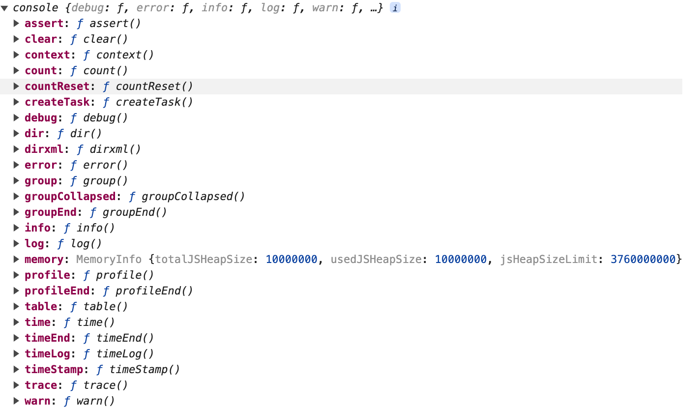
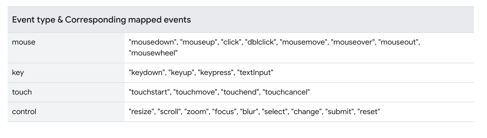
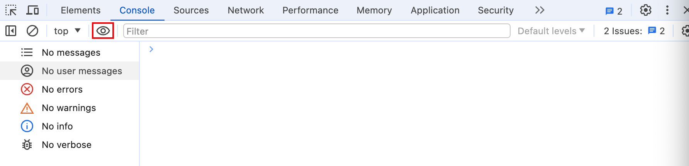
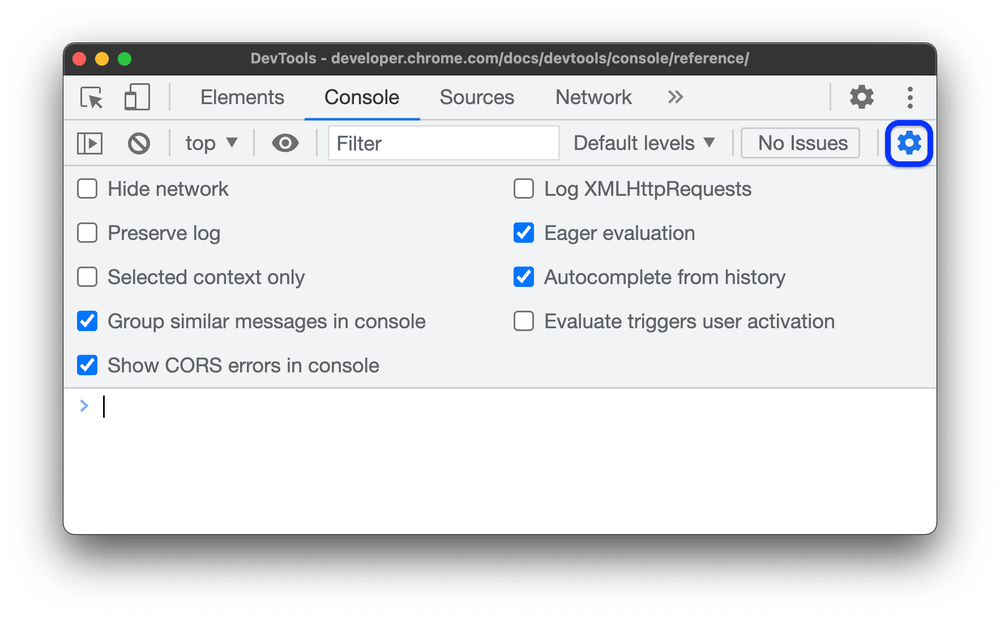
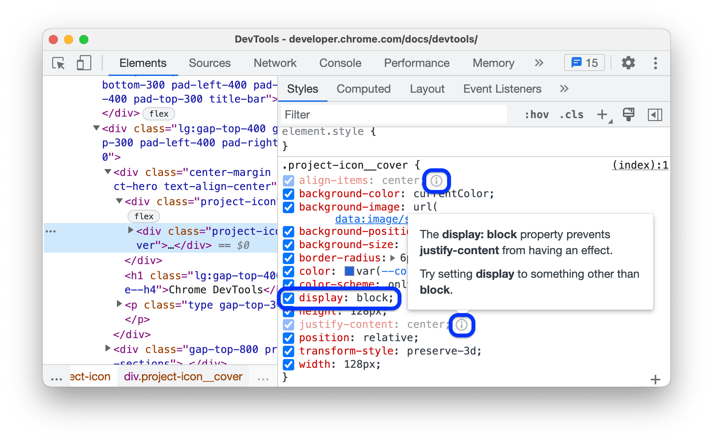
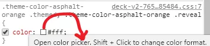
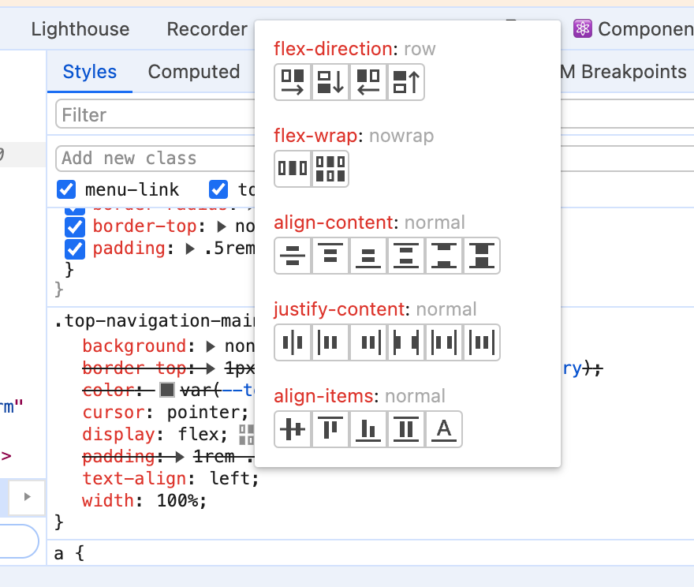
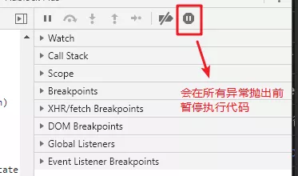
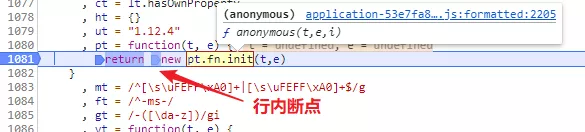
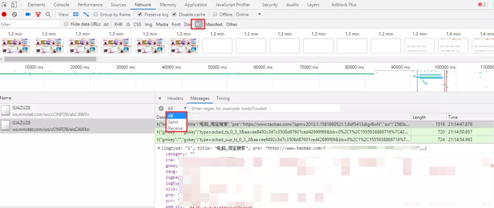

# Chrome devtool

**Chromium**：是谷歌的开源项目，由开源社区维护。

**Chrome**：基于 Chromium，但是它是闭源的。

实验性功能 ：chrome://flags/

> `esc`：显示 第二面板

## Console

快捷键：⌘ + ⌥ + J 或 ⇧ + ⌘ + C

面板命令：show console drawer

### console API



#### console.dir

```
console.dir(document.head);
```

> 可以简写为 dir

#### console.count

```js
console.count();
console.count("coffee");
console.count();
console.count();
```

#### console.countReset

```js
console.countReset();
console.countReset("coffee");
```

#### console.group / console.grounEnd

```js
const label = "Adolescent Irradiated Espionage Tortoises";
console.group(label);
console.info("Leo");
console.info("Mike");
console.info("Don");
console.info("Raph");
console.groupEnd(label);
```

> console.groupCollapsed

#### console.table

```js
var people = [
  {
    first: "René",
    last: "Magritte",
  },
  {
    first: "Chaim",
    last: "Soutine",
    birthday: "18930113",
  },
  {
    first: "Henri",
    last: "Matisse",
  },
];
console.table(people);
```

```js
// 自定义列
console.table(people, ["last", "birthday"]);
```

> 可以简写为 table

#### console.time / console.timeEnd

```js
console.time();
for (var i = 0; i < 100000; i++) {
  let square = i ** 2;
}
console.timeEnd();
```

#### console.trace

```
const first = () => { second(); };
const second = () => { third(); };
const third = () => { fourth(); };
const fourth = () => { console.trace(); };
first();
```

> https://developer.mozilla.org/en-US/docs/Web/API/console

### 工具 API

#### $\_

最近一次表达式的值


#### $0 - $4

历史选择的元素

#### $(selector [, startNode])

document.querySelector 简写

#### $$(selector [, startNode])

document.querySelectorAll 简写

```js
let images = $$("img");
// let images = $$('img', document.querySelector('.devsite-header-background'));
for (let each of images) {
  console.log(each.src);
}
```

### $i

在 `devtools` 里面来使用 `npm` 插件

[Console Importer](https://link.juejin.cn/?target=https%3A%2F%2Fchrome.google.com%2Fwebstore%2Fdetail%2Fconsole-importer%2Fhgajpakhafplebkdljleajgbpdmplhie%2Frelated)

```js
const v1 = _.defaults({ 'a': 1 }, { 'a': 3, 'b': 2 });
console.log(v1)
// → { 'a': 1, 'b': 2 }
const v2 = _.partition([1, 2, 3, 4], n => n % 2);
// → [[1, 3], [2, 4]]
console.log(v2)
```

#### copy(object)

复制值到粘贴板

#### debug(function)

调试指定函数

> undebug：取消调试

#### inspect(object/function)

定位到某个元素

#### getEventListeners(object)

获取所有事件

```js
getEventListeners(document);
```

#### keys / values

与 Object.keys 、 Object.values 类似

#### monitor(function)

监听函数

```js
function sum(x, y) {
  return x + y;
}
monitor(sum);
```

> umonitor：取消监听

#### monitorEvents(object [, events])

监听事件

```js
monitorEvents(window, "resize");
```

```js
monitorEvents(window, ["resize", "scroll"]);
```

```js
monitorEvents($0, "key");
```



> unmonitorEvents：取消监听

#### queryObjects(Constructor)

返回使用该构造函数的清单

```js
queryObjects(Promise);
queryObjects(Object);
queryObjects(Map);
```

### 监听表达式变化



监听 dom 宽度变化 或 值变化

```js
document.body.clientWidth;
```

```js
let count = 1;
setInterval(() => {
  count++;
}, 1000);
```

### console 设置



Log XMLHttpRequests：接口调用

Preserve log : 保存日志记录

Eager evaluation：预览表达式值

## Element

### Dom

#### 元素操作

按 ⌥ 并点击箭头：展开或折叠所有后代

h 键：快速隐藏/显示元素（visibility:hidden）

⌘ + F：搜索元素

Delete 键： 删除元素

双击：修改元素内容

编辑 html：批量修改元素

⇧ + ⌥ + ↓ / ↑：重复元素

鼠标拖拽：调整元素顺序

#### 其他操作


Force state：设置元素状态

Capture node screenshot：截图当前节点

Scroll into view：定位到当前元素

Badge settings：辅助标签

> 面板中开启 show rules and hoverhttps://developer.chrome.com/docs/devtools/elements/badges

### Styles

#### css 面板

匹配元素为常规颜色，未匹配的元素为灰色


无效值、无效属性提示


未生效的属性



继承属性为常规颜色，未继承属性为灰色


不可更改样式（斜体）

1. user agent stylesheet - 浏览器默认样式


2. 通过属性控制的样式


计算得出的值为灰色


#### 属性详情（mdn）


#### 权重查看


#### 查看 hover 样式

1. 面板中开启 show rules and hover
2. styles 中 :hover

#### 按住 shift 点击色块，快速切换颜色格式 rgb/hsl/hex



#### 查看网站所有颜色变量


#### 调试 flex




## Sources

### Debug

在源代码面板中可以设置**断点**来调试 JavaScript


#### 异常断点



#### 函数断点

`debug()`：调试的函数名作为参数，调用可以在每次执行该函数前暂停执行代码

#### 单步调试

- step over next function
- step into next function
- step out current function
- step

step 和 step over/into 区别

- step 会优先尝试 step into，当没有可步入的代码时，就会执行 step over


> **Continue to here**：继续执行至此行

#### 行内断点

行断点内多个箭头



### BlackBox

在调试中忽略某些脚本，在 Call Stack 堆栈中会将该脚本隐藏，单步调试时也不会步入脚本中的任何函数

```JS
function animate() {
    prepare();
    lib.doFancyStuff(); // A
    render();
}
```

A 行，调用的是第三方库的 doFancyStuff 函数。

如果确 三方库没有 bug，`BlackBox` 整个第三方库的 js 脚本，在调试中跳过这些代码的执行

#### 三种方式

方式 1：在源代码窗格右键，选择"BlackBox Script"


方式 2： Call Stack 中右键某一帧，选择"BlackBox Script"


方式 3： Blackboxing 面板添加**正则表达式**匹配**文件名**


### Devtools Nodejs debug

node 执行 js 文件，文件名前加--inspect 标志，启用浏览器 nodejs 调试


### Source Map

组合/压缩 css,js 文件是常见的性能优化方案

开启`source map`：settings -> preference -> sources

- `Enable Javascript source maps`和`Enable CSS source maps`

source map 映射信息存在 json 对象中，保存在 .map 文件中

- 可由编译程序添加注释`//# sourceMappingURL=/path/to/script.js.map`至生产文件末尾，
- 可由服务端在响应头中添加`X-SourceMap: /path/to/script.js.map`，将 map 文件与生产文件对应

### Local Overrides

用于覆盖网络请求

### Content scripts

浏览器插件的脚本，在特定网页的上下文中运行

### Snippets

snippets 中，选中代码并`ctrl enter`，或点击右下角的执行按钮，即可执行代码片段

## Network


- Preserve Log：保存显示跨页面的加载请求
- Disable Cache：禁用浏览器缓存，模拟新用户打开页面的体验
- Offline 是模拟断网离线的状态，其后的下拉框可以选择模拟其他网络状况，比如 2G,3G

### filter

filter 文本框中可输入请求的属性 对 请求进行过滤，多个属性**用空格**分隔

支持过滤的属性：

`domain`：**指定域**的资源。
`has-response-header`：指定 HTTP **响应标头**的资源
`is`： is:running 可以查找 WebSocket 资源。
`larger-than`：**大于指定大小的资源**（以字节为单位）。1000 为 1k。
`method`：指定 **HTTP 方法**资源
`mime-type`：指定 **MIME 类型**的资源
`mixed-content`：显示所有混合内容资源 (mixed-content:all)
`scheme`：通过未保护 HTTP (scheme:http) 或受保护 HTTPS (scheme:https) 检索的资源。
`set-cookie-domain`：具有 Set-Cookie 标头并且 Domain 属性与指定值匹配的资源
`set-cookie-name`：具有 Set-Cookie 标头并且名称与指定值匹配的资源
`set-cookie-value`：显示具有 Set-Cookie 标头并且值与指定值匹配的资源
`status-code`： **HTTP 状态代码**与指定代码匹配的资源。

> 例如：mime-type:image/gif larger-than:1K 显示大于一千字节的所有 GIF

- `Hide Data URLs`：隐藏 **data 类型的 url**[1]

`Data URLs` ：前缀为 data: 协议的的 URL。允许内容创建者向文档中嵌入小文件，例如浏览器 API canvas 支持的 base64 编码格式图片

### 瀑布图

瀑布图按时间线展示所有请求

`DOMContentLoaded`： 浏览器已经加载了 HTML，DOM 树已经构建完毕，**资源还未下载**

`load`：浏览器已经加载了所有的资源（图像，样式表等）。

`beforeunload/unload`：当用户离开页面的时候触发。

### 网络请求列表

`Replay XHR`：重播请求

`Copy As Fetch`：请求**复制为 Fetch 代码**

`Clear Browser Cache`：手动清除浏览器缓存

`Clear Browser Cookies`：手动清除浏览器 Cookie


`Initiator`：请求的来源/发起者。

`parser`：一般来自解析器解析到的 html 页面内的请求

`script`：来自脚本文件的请求。鼠标悬浮到 Initiator 列中的文件名上，可以看到发起当前请求的堆栈轨迹，点击文件名，可以定位到直接发起请求的代码

`size`：在 size 列中，有两个数值，上面的较小值代表下载到的资源的大小，下面的较大值是资源解压后的大小。

**按住`shift`鼠标悬浮在请求行上**

- 绿色：当前行的发起者
- 红色：当前行的依赖项

### websocket



## Performance

performance 面板可以用于**分析运行时性能**。与页面加载性能相区分

[参考](https://mp.weixin.qq.com/s?__biz=MzA5NjM5MjM1Nw==&mid=2650284189&idx=1&sn=6bf640e28cf02097b73e5885d750cde8&chksm=88bc4557bfcbcc41e792cf7b11b7c19b610cd3eb5f35808066489889286319161f6466776a68&cur_album_id=1349545506497855489&scene=189#wechat_redirect)

## Memory

[参考](https://mp.weixin.qq.com/s?__biz=MzA5NjM5MjM1Nw==&mid=2650284228&idx=1&sn=d0ca8b3476ad8ba891dba9c5468ee1fb&chksm=88bc450ebfcbcc18339aa4272997ec85dca736553c40c6af67e47a2faa5e954047b13f8558cb&cur_album_id=1349545506497855489&scene=189#wechat_redirect)

## 黑魔法

### 快速查看页面结构

```js
$$("*").forEach((i) => {
  i.style.outline =
    "1px solid #" + (~~(Math.random() * (1 << 24))).toString(16);
});
```

### 调试 hover 元素

```js
setTimeout(() => {
  debugger;
}, 1000);
```

### 实时编辑文本

```js
document.body.contentEditable = true;
```

### 快速执行代码块

⌘ + P ===> !snippest_name

### 引用类型打印问题

```js
let person = {a:0, b:0, c:0, d:0, e:0, name: 'Tomek'}
console.log(person);
person.a = 1;
person.name = 'Not Tomek';
console.log(person);
```

```js
let person = {a:0, b:0, c:0, d:0, e:0, name: 'Tomek'}
console.log(JSON.stringify(person));
person.a = 1;
person.name = 'Not Tomek';
console.log(JSON.stringify(person));
```


## 相关链接

[Devtools 老师傅养成系列](https://mp.weixin.qq.com/mp/appmsgalbum?__biz=MzA5NjM5MjM1Nw==&action=getalbum&album_id=1349545506497855489&scene=173&from_msgid=2650283949&from_itemidx=1&count=3&nolastread=1#wechat_redirect)

https://developer.chrome.com/docs/devtools
