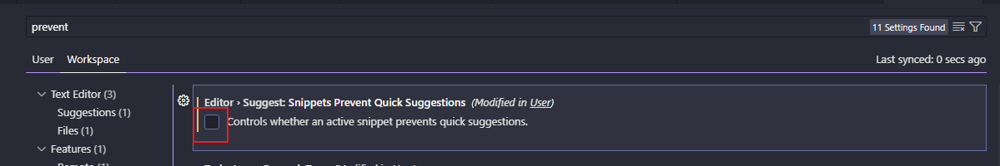

# vscode

## live server 配置 https

git bash 自带 openssl

1. 生成私钥

```bash
openssl genrsa -out privatekey.pem 1024
```

2. 根据私钥生成签名

```bash
openssl genrsa -out privatekey.pem 1024
```

3. 通过私钥和签名 生成证书

```bash
openssl x509 -req -in certrequest.csr -signkey privatekey.pem -out certificate.pem
```

操作后，生成以下三个文件

```
privatekey.pem
certrequest.csr
certificate.pem
```

4.  在 vscode 安装 Live Server
5.  配置 settings.json（建议绝对定位）

```json
"liveServer.settings.https": {
	"enable": false, //set it true to enable the feature.
	"cert": "E:\\**\\certificate.pem",
	"key": "E:\\**\\privatekey.pem"
 }
```

## \#region folding for VS Code

插件说明：用 #region 包裹代码，[下载地址](https://marketplace.visualstudio.com/items?itemName=maptz.regionfolder)

默认不支持 vue，以下配置 vue 格式支持

```json
"maptz.regionfolder": {
    "[vue]": {
      "defaultFoldStartRegex": "\\// [\\s]*#region\\(collapsed\\)[\\s]*(.*)",
      "foldEnd": "// #endregion ",
      "foldEndRegex": "\\//[\\s]*#endregion",
      "foldStart": "// #region [NAME]",
      "foldStartRegex": "\\// [\\s]*#region[\\s]*(.*)"
    }
  }
```

## vscode 代码提示未默认选中第一行

问题：vscode 代码提示，为默认选中第一个

解决：user.json -> 输入 `prevent` -> 取消勾选 Editor › `Suggest: Snippets Prevent Quick Suggestions`


