# Fildder 使用

> https://blog.csdn.net/qq_37688023/article/details/106609936

## 一、Fiddler 原理与下载

Fiddler 可以理解为**处于客户端和服务器之间的代理服务器**。通过在各浏览器、Andoird、IOS 设备上设置 Fiddler 的代理，从而可以监听客户端上发生的 HTTP(S)请求。

这篇博客是在 B 站上看完一个详细教程后编写的，想看视频的可以直接点击链接去看：[链接\_Fiddler 教程](https://www.bilibili.com/video/BV1c4411c7zH?p=3)

- 下载链接：可以直接官网上下载，也可以点击下面链接下载 [百度云链接](https://pan.baidu.com/s/1Ru_0HEcbwKqualM6bhQAeA)，提取码：g7nz

## 二、Fiddler 设置代理

### 2.1 谷歌、IE 浏览器

由于谷歌浏览器和 IE 浏览器启动的时候，就会默认读取系统代理，所以只需要将 Fiddler 设置为启动后作为系统代理即可。

设置启动即作为系统代理——点击 `Tools -> Options -> Connections`


这样设置后，我们在谷歌浏览器和 IE 浏览器访问 HTTP 请求，就会在 Fiddler 工具左侧中显示出请求，但是 HTTPS 的请求却没有显示出来，这是为什么呢？

原因如下：Fiddler 作为一个代理服务器，是可以代理到 HTTPS 请求的。但是 HTTPS 可以理解为 HTTPS=HTTP+SSL/TLS,也就是 HTTPS 是加密的，是有证书存在的。所以我们需要 **配置解密 HTTPS 并安装证书**。

配置解密 HTTPS 并安装证书——点击 `Tools -> Options -> HTTPS`。


查看证书是否安装成功。


最后效果——浏览器中访问 HTTPS 的页面，也能在 Fiddler 中显示。
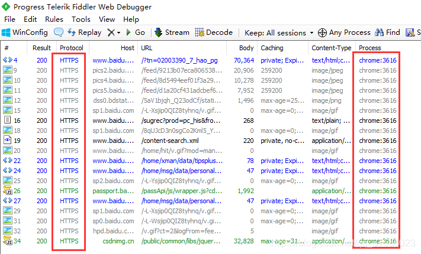

### 2.2 火狐浏览器

谷歌和 IE 浏览器是直接使用系统代理，且使用系统的证书。但是**火狐浏览器默认不是使用系统代理**，且使用的不是系统的证书，是自己管理自己的证书。
所以**对于火狐浏览器，需要先设置为使用系统代理，再在火狐浏览器中导入 Fiddler 的证书**。

火狐浏览器设置使用系统代理

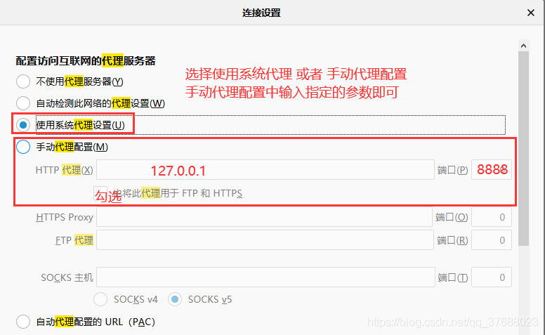

Fiddler 导出证书


火狐浏览器导入证书

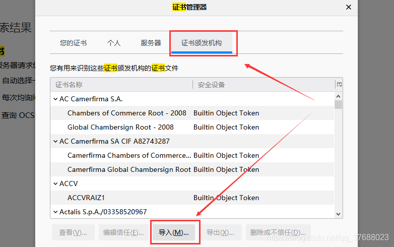


最后效果——浏览器中访问 HTTPS 的页面，也能在 Fiddler 中显示。


### 2.3 Android 客户端

首先，使用 Fiddler 对 Android 客户端抓包的时候，**需要手机连接的 WIFI 和 Fiddler 电脑本机使用的同一个网络**，这样才能做数据通信。

Fiddler 设置——允许远程主机连接


手机 WLAN 设置代理


下载证书


安装证书


> 提示：按照上面的配置后，按照正常情况下，就能抓到 HTTPS 的包了。但是由于 Android7 之后，系统只信任系统预置的 CA 证书，不会信任用户安装的 CA 证书。具体参考：[这是一个链接](https://gaojiajun.cn/2018/08/charles-notTrust-in-android7.0/)

### 2.4 IOS 客户端

由于穷，没有演示 IOS 客户端的办法，请直接查看视频：[IOS 抓包](https://www.bilibili.com/video/BV1c4411c7zH?p=23)

## 三、Fiddler 界面及功能

可以将 Fiddler 从界面上划分，分为五个部分：菜单栏、工具条、监控面板（回话列表）、辅助标签（工具）、命令行+状态栏。


### 3.1 菜单栏

#### 3.1.1 Rules-规则

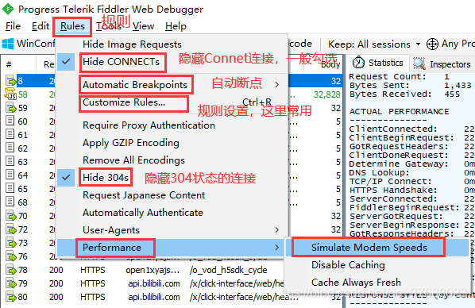

#### 3.1.2 Tools—工具


### 3.2 工具条

#### 3.2.1 Comments—备注

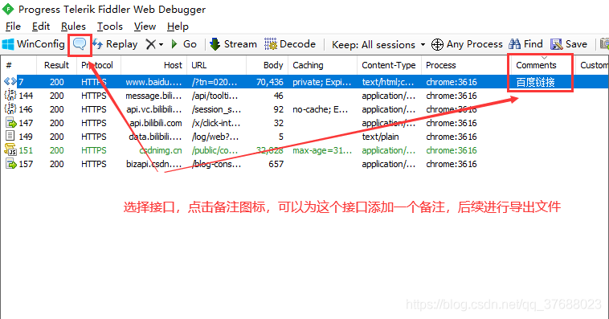

#### 3.2.2 Replay—重放

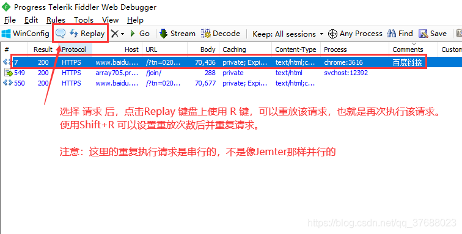

#### 3.2.3 Remove—移除

移除所有 Remove ALL 的快捷键为 `Ctrl+X`


#### 3.2.4 Go—转到下一步（结束断点）


#### 3.2.5 Stream—流模式


#### 3.2.6 Decode—解码


#### 3.2.7 Keep Sessions—保持回话


#### 3.2.8 Pick target—选择捕获对象

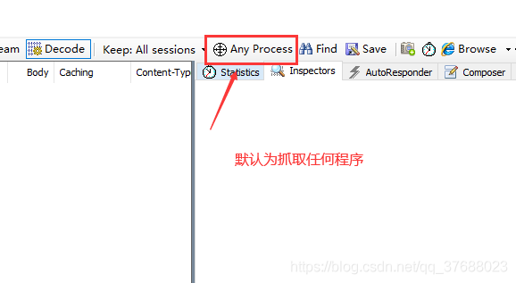
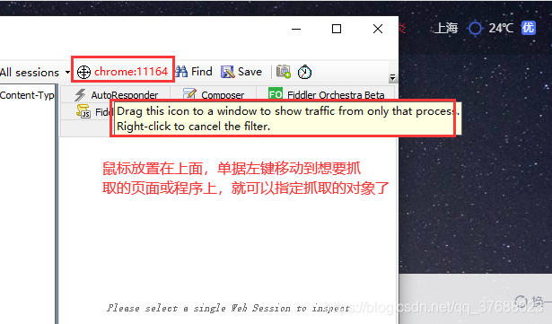

#### 3.2.9 Find 查找—Save 保存


#### 3.2.10 浏览器快捷方式


#### 3.2.11 TextWizard—文本编码解码器

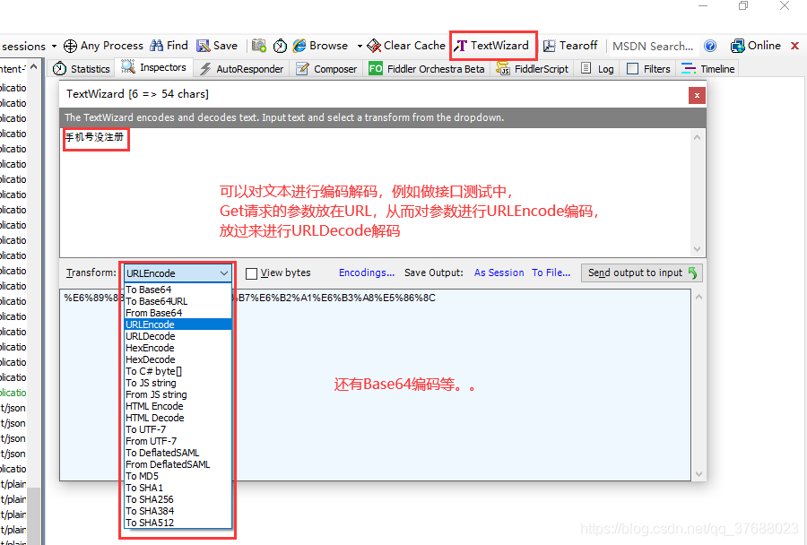

### 3.3 监控面板（回话列表）

#### 3.3.1 字段含义


#### 3.3.2 添加 IP 列

参考链接：[Fiddler 显示服务器 ip 地址列](https://blog.csdn.net/qiqizhiyun/article/details/52385717)

点击菜单栏 `rules—>customize rules`...


`ctrl+f` 搜索 static function main


在 main 函数里加入下面一行代码，调用 fiddlerUI 函数，显示 ip 地址列 

```
FiddlerObject.UI.lvSessions.AddBoundColumn("IP 地址",120,"X-HostIP");
```

保存后关闭，重启 Fiddler 即可
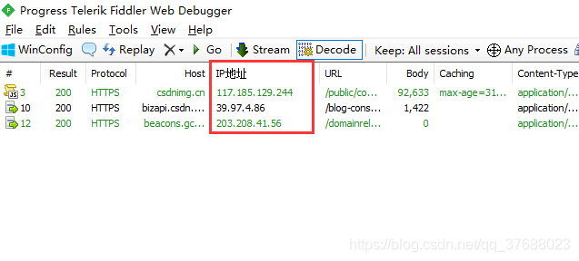

#### 3.3.3 添加响应时间列

点击菜单栏 `rules——customize rules`...


找到 class Handlers，并在其中添加下面代码


```js
function BeginRequestTime(oS: Session)
{
	if (oS.Timers != null)
	{
		return oS.Timers.ClientBeginRequest.ToString();     
	}
	return String.Empty;
}


public static BindUIColumn("响应时间")
function CalcTimingCol(oS: Session){
	var sResult = String.Empty;
	if ((oS.Timers.ServerDoneResponse > oS.Timers.ClientDoneRequest))
	{
		sResult = (oS.Timers.ServerDoneResponse - oS.Timers.ClientDoneRequest).ToString();
	}
	return sResult;
}

```

保存后退出，重启后即可。
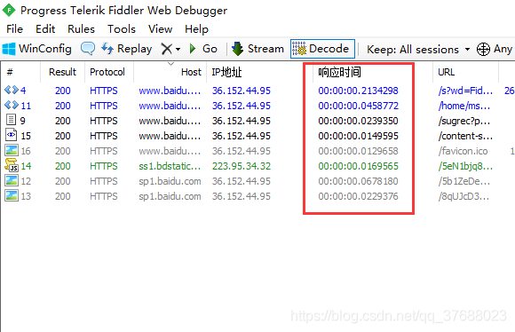

### 3.4 辅助标签（工具）

#### 3.4.1 Statistics—统计数据

代表详细的数据，具体参考：[这是一个链接](https://blog.csdn.net/qq_33250158/article/details/99640810)


#### 3.4.2 Inspector—检查器

可以理解为请求、响应的详细信息。
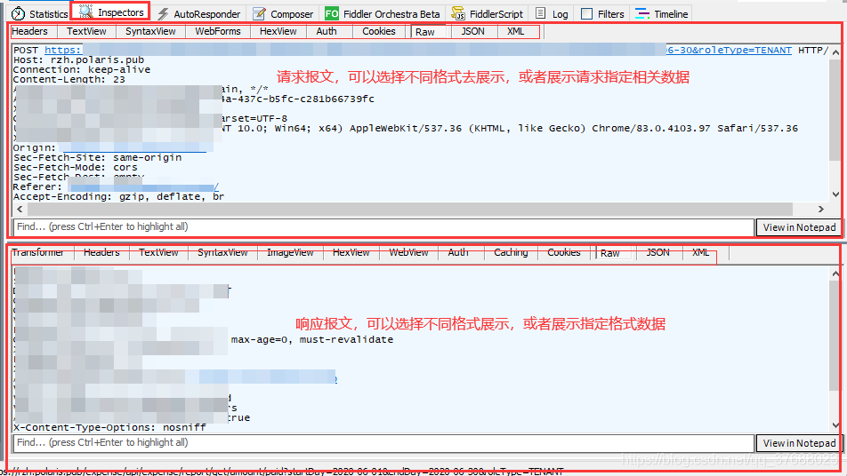

#### 3.4.3 AutoResponder—自动响应器（重要）

含义：可以用于拦截某一个请求，进行如下操作：

（1）重定向到本地资源

（2）使用 Fiddler 内置响应

（3）自定义响应

实例一：将网站中的图片请求设置内置响应 403。原本的图片如下：

在自动响应器中添加规则，请求匹配中填写图片链接，响应这里选择内置的 403 即可。
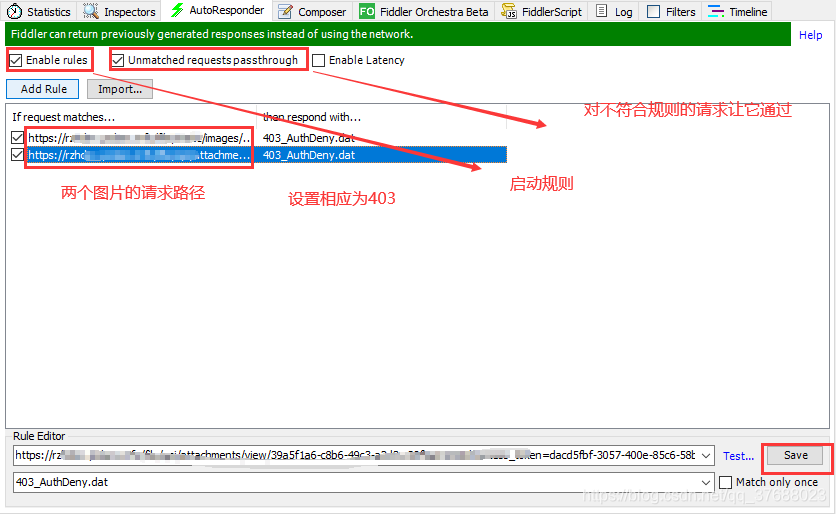
再次请求页面，图片加载失败。


除了使用**内置响应**，也可以使用本地文件。


还可以通过点击 `Edit Response` 来自定义响应。


在实际工作中，我们可以使用自动响应器来做以下工作：
（1）Web 调试：在相关接口未开发完事，使用作为调试
（2）Mock 测试：自定义响应，从而不影响实际的数据，例如有时在生产环境中不能产生脏数据。
（3）极端测试：例如自定义某个请求的响应为空，去查看前端界面的展示。

#### 3.4.3 Composer—设计器（重要）

功能为设计请求,即为**模拟请求**发送。可以认为一个简单的接口测试工具，例如 Postman 功能。

自定义请求并发送


修改请求并发送—类似于接口测试。在 Fiddler 捕获到请求后，将要进行测试的接口拖动到 Composer 中，修改参数，点击发送就达到接口测试的效果了。


#### 3.4.4 Filter—过滤器

用于对请求过滤，具体自己实际试一下即可。
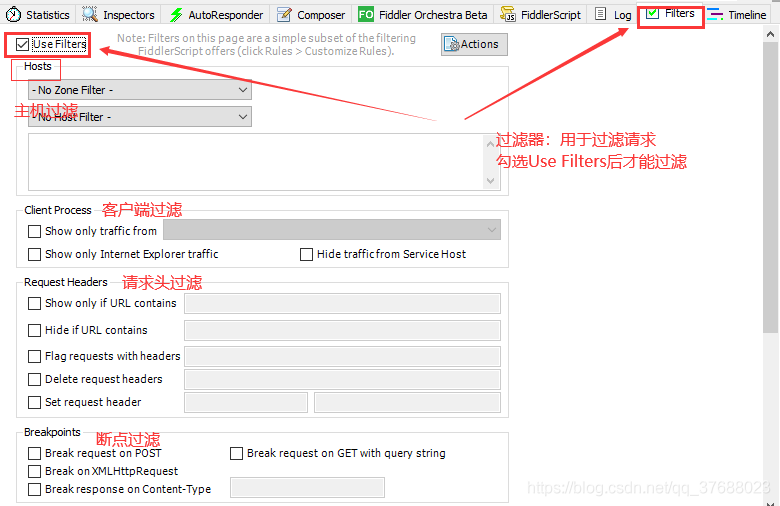
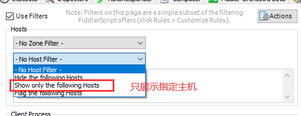


### 3.5 命令行+状态栏

#### 3.5.1 QuickExec—命令行

官方给出的命令教程：[这个是一个教程](https://docs.telerik.com/fiddler/knowledgebase/quickexec)


#### 3.5.2 请求前断点 & 响应后断点

请求前断点：请求从客户端发出，但是未发送到服务器
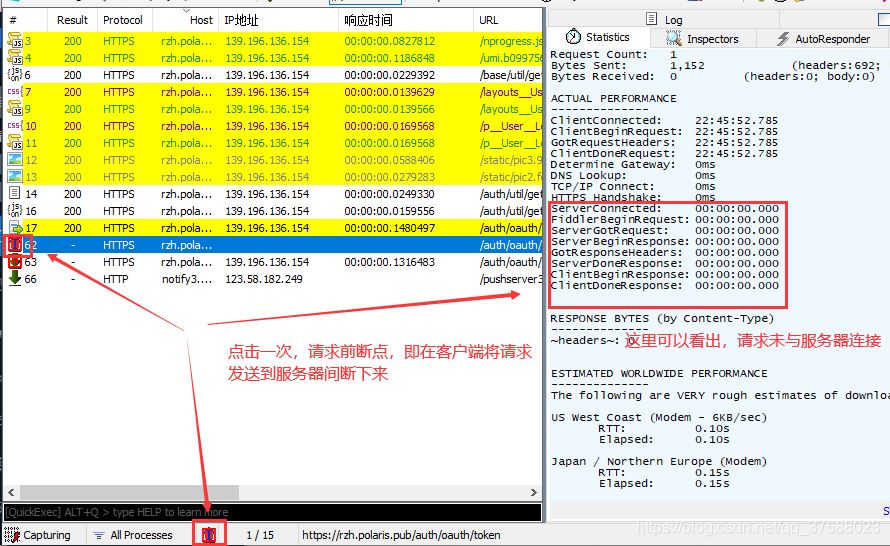

响应后断点：响应从服务器发出，但是未到达客户端


#### 3.5.3 捕获

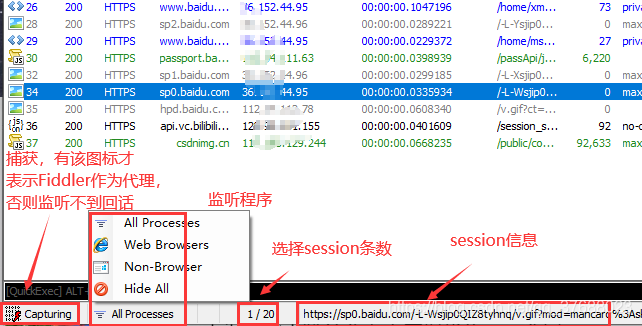

### 3.6 其他内容

#### 3.6.1 断点应用

断点可以分为全局断点和局部断点。全局断点又可以分为请求前断点和响应后断点。之前点击命令行下的位置就是全局断点。

全局断点—请求前断点：可以在请求到达服务器之前，进行数据篡改。

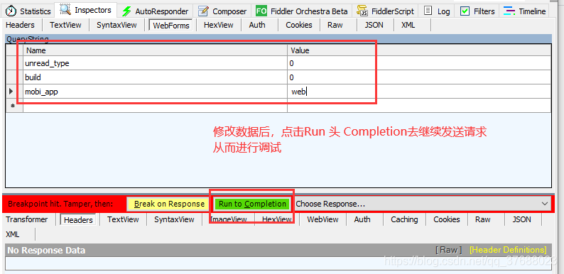

全局断点—响应后断点。与请求前断点道理一样，可以修改响应结果，然后返回响应。这里还可以使用响应后断点模拟网络中断，打了断点之后，客户端迟迟收不到服务器的响应，就类似网络中断了,然后由于客户端的超时机制，查看显示是否友好。

局部断点—通过命令完成局部断点

请求前断点：bpu 匹配内容 
响应后断点：bpafter 匹配内容 


#### 3.6.2 弱网测试

弱网测试：就是模拟网络限速的情况下，请求及响应的情况。参考链接：[弱网测试](https://www.cnblogs.com/longronglang/p/9524889.html)

启动网络限速，打开 Fiddler，`Rules->  Performance -> 勾选 Simulate Modem Speeds`

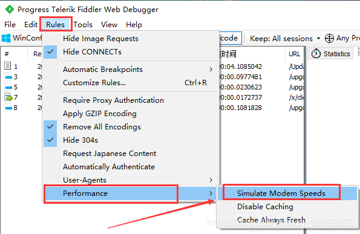

具体设置：`Rules —> Cutomize Rules 打开 CustomRules.js 文档`
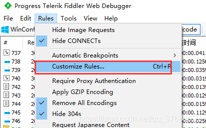

搜索 m_SimulateModem。
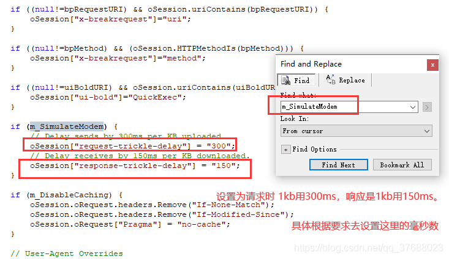

## 四、写在最后

Fiddler：从抓包到入狱,。抓包抓的好，牢饭吃的饱。请谨慎使用。
