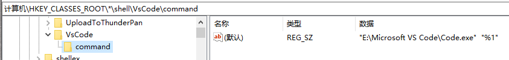
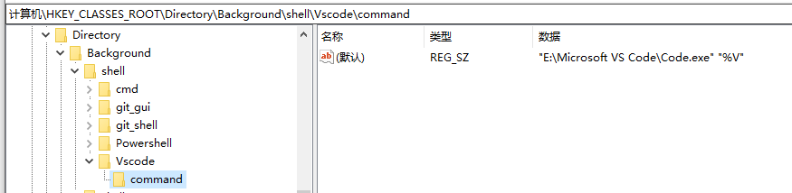

# Window

## 右键打开

### 打开文件

`\HKEY_CLASSES_ROOT\*\shell`

1, `Win+R` 打开运行，输入`regedit`，打开`注册表`，找到`HKEY_CLASSES_ROOT\*\shell`分支，如果没有 shell 分支，则在`*`下点击右键，选择“`新建`－`项`”，建立 shell 分支。

2, 在 shell 下新建“`VisualCode`”项，在右侧窗口的“**默认**”双击，在数据里输入“`用VSCode打开`”。~~这是右键上显示的文字~~

3, 在“`VisualCode`”下再新建`Command`项，在右侧窗口的“**默认**”键值栏内输入程序所在的安装路径，我的是：`"D:\anzhuang\Microsoft VS Code\Code.exe" "%1"`。**其中的%1 表示要打开的文件参数**。

4, 配置缩略图。在`VisualCode`项上新建`可扩充字符串值`，命名为`Icon`，双击，把`"D:\anzhuang\Microsoft VS Code\Code.exe"`放进数据就可以了。




### 打开文件夹

`HKEY_CLASSES_ROOT\Directory\shell`

1, `Win+R` 打开运行，输入`regedit`，打开`注册表`，找到`HKEY_CLASSES_ROOT\Directory\shell`分支

2, 同上面的 2 一样，数据内的值为“`用VSCode打开文件夹`”

3、4、5、步骤完全一样，不再重复说明了。


### 右键空白，打开文件

`HKEY_CLASSES_ROOT\Directory\Background\shell\`

1. `Win+R` 打开运行，输入`regedit`，打开`注册表`，找到`HKEY_CLASSES_ROOT\Directory\Background\shell\`分支

2、同上面的 2 完全一样

3、同上，把 `%1` 改为`%V`，例如：`"D:\anzhuang\Microsoft VS Code\Code.exe" "%V"`

4、5 同上，完全一样




## 找回 windows 图片查看器

1. 新建文件 .txt
2. 将内容 写入 文件
3. 更改文件后缀为 `.reg`
4. 双击运行

```shell
Windows Registry Editor Version 5.00

 ; Change Extension's File Type

 [HKEY_CURRENT_USER\Software\Classes\.jpg]

 @="PhotoViewer.FileAssoc.Tiff"

 ; Change Extension's File Type

 [HKEY_CURRENT_USER\Software\Classes\.jpeg]

 @="PhotoViewer.FileAssoc.Tiff"

 ; Change Extension's File Type

 [HKEY_CURRENT_USER\Software\Classes\.gif]

 @="PhotoViewer.FileAssoc.Tiff"

 ; Change Extension's File Type

 [HKEY_CURRENT_USER\Software\Classes\.png]

 @="PhotoViewer.FileAssoc.Tiff"

 ; Change Extension's File Type

 [HKEY_CURRENT_USER\Software\Classes\.bmp]

 @="PhotoViewer.FileAssoc.Tiff"

 ; Change Extension's File Type

 [HKEY_CURRENT_USER\Software\Classes\.tiff]

 @="PhotoViewer.FileAssoc.Tiff"

 ; Change Extension's File Type

 [HKEY_CURRENT_USER\Software\Classes\.ico]

 @="PhotoViewer.FileAssoc.Tiff"

```

## bat

### 关机命令

```shell
shutdown -a　#取消关机

shutdown -s #关机

shutdown -f　#强行关闭应用程序。

shutdown -m #计算机名　控制远程计算机。

shutdown -i　#显示[图形用户界面](https://baike.baidu.com/item/图形用户界面)，但必须是Shutdown的第一个参数。

shutdown -l　#注销当前用户。

shutdown -r　#关机并重启。

shutdown -s -t <关闭时间> -c "<提示>"

shutdown -s -t 时间　# 设置关机倒计时。 设置关闭前的超时为 xxx 秒
```

## 自定义 bat 开启应用

```bash
start "" "E:\qq\Bin\QQScLauncher.exe"&ping localhost -n 0
start "" "E:\WeChat\WeChat.exe"&ping localhost -n 1
::start "" "E:\HbuilderX\HBuilderX\HBuilderX.exe"&ping localhost -n 2
::start "" "E:\Microsoft VS Code\Code.exe"&ping localhost -n 2
```

`start "" path&&ping localhost -n 0`

> `&ping localhost -n 0`：可选项，表示 1 秒延迟

```shell
start "" "E:\qq\Bin\QQScLauncher.exe"&ping localhost -n 0
start "" "E:\WeChat\WeChat.exe"&ping localhost -n 1
start "" "E:\HbuilderX\HBuilderX\HBuilderX.exe"&ping localhost -n 2
::start "" "E:\Microsoft VS Code\Code.exe"&ping localhost -n 2
```

## cmd

### 查看文件树形结构

`tree/?`：帮助 `tree`：文件夹结构 `tree/f`：含文件名

`tree/f file.txt`：导出文件树到 file.txt

> `/?`：可以查看命令说明
>
> eg ： `tree /?`

### 查看端口占用

```shell
netstat -aon # 查看所有端口

netstat -aon|findstr "8000" # 查看8000端口
```

### 终止进程

```shell
taskkill /pid 1234 # 终止pid为1234的进程
```

