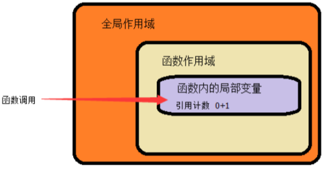

# JavaScript

JavaScript，是一种客户端脚本语言，主要用来向 HTML 网页添加各式各样的动态功能,为用户提供更流畅美观的浏览效果

可以直接嵌入 HTML 页面，但写成单独的 js 文件有利于结构和行为的分离

> JS 主要运行于客户端（浏览器），也可以运行在服务端（操作系统）

## JavaScript 组成

ECMAScript 是一套标准，定义了**一种语言的标准**，规定了基本语法、数据类型、关键字、具体 API 的设计规范等，解析引擎设计的参考标准，但与具体实现无关


**ECMAScript** - JavaScript 核心

- **语法标准**，描述了 JavaScript 语言的基本语法和数据类型

**BOM** - 浏览器对象模型

- **操作浏览器**功能的 API，通过 BOM 可以操作浏览器窗口

**DOM** - 文档对象模型

- DOM 可以把 HTML 看做是文档树，通过 DOM 提供的 API 可以对树上的节点进行操作

## 三种引入方式

方式一：行内

```html
<input type="button" value="按钮" onclick="alert('Hello World')" />
```

方式二：script 标签内

```html
<script>
  alert('Hello World!')
</script>
```

方式三：写在外部文件，页面引入

```html
<script src="main.js"></script>
```

> 引用外部 js 文件 script 标签中不可以再写 JavaScript，写了也会覆盖

## 变量

变量是计算机内存中存储数据的标识符，根据变量名称可以获取到内存中存储的数据

### 变量使用

声明变量： `var age`

变量的赋值： `var age;age = 18;`

声明多个变量 ：`var age, name;`

声明并赋值：`var age = 10, name = 'zs';`

### 变量命名规则和规范

规则

- 由**字母、数字、下划线、$**符号组成，且**不能以数字开头**
- 区分大小写
- 不能是关键字和保留字

规范

- 变量名必须有意义
- 遵守驼峰命名法

## 数据类型

### 简单数据类型

Number、String、Boolean、Undefined、Null

> 获取数据类型 -> typeof age

#### Number

**数值字面量**：数值的固定值的表示法

**数值范围**

- 最小值：Number.MIN_VALUE（5e-324）
- 最大值：Number.MAX_VALUE（1.7976931348623157e+308）
- 无穷大：Infinity
- 无穷小：-Infinity

> **不要直接判断浮点数是否相等**

#### String

'abc' "abc" 单双引号引起来的一连串字符

- length 属性：字符串长度
- 字符串拼接：使用 +

> 两方都是数字，+号算术功能。一方为字符串，+号为字符串拼接

#### Boolean

值为：true 和 false

#### Undefined

声明了没有赋值的变量

#### null

变量为空。（需手动设置）

### 复杂数据类型

#### Object

键值的形式

instanceof：判断一个值，是否是某一个构造函数的实例对象

### 数据类型转换

#### 转成字符串

**toString()**：`s.toString()`

**String()**：`String(s)`

toString 和 String 的区别

String：用于处理没有 toString() ，eg：**undefined 和 null**

#### 转成数值类型

**Number()**：**把任意值转换成数值**，转换的字符串中有一个不是数值的字符，返回 NaN

```js
Number(null) // 0
Number(undefined) // NaN
```

**parseInt()**：**字符串转换成数值**

- 第一个字符是数字，直接解析，遇到非数字结束
- 第一个字符不是数字或者符号（`+-`），返回 NaN

**parseFloat()**：**字符串转换成浮点数**，解析第一个`.` 遇到第二个`.`或者非数字结束

#### 转成布尔类型

**Boolean()**：任意数值转为 bool 值，以下转为 false，其余为 true

```js
Boolean(0)
Boolean('')
Boolean(null)
Boolean(undefined)
Boolean(NaN)
Boolean(false)
```

## 操作符

**表达式**：值和操作符运算会有一个结果

**算术运算符**：`+ - * / %`

**一元运算符**：只有一个操作数的运算符，会直接修改原始变量数据

- **前置`++/--`**：先+/-1，再运算
- **后置`++/--`**：先运算，再+/-1

**逻辑运算符**

- **`&&`与运算**： 同真为真，其余为假
- **`||`或运算**： 左边为真则取左边，左边为假则边右边
- **`! `非运算**： 取反

**关系运算符**：`< > >= <= == != === !==`

`==`与`===`的区别：前者比较值，后者比较值和类型

**赋值运算符**：`= += -= *= /= %= `


## 流程控制

三种基本结构

**顺序结构**： 从上到下执行的代码

**分支结构**：根据不同的情况及判断，执行对应代码

**循环结构**：重复执行一段代码

### 分支结构

#### if 语句

```javascript
if(){
}else if(){
}else{
}
```

**三元运算符**：`表达式1 ? 表达式2 : 表达式3`

> if...else 简化

#### switch 语句

switch 语句在比较值时使用**全等操作符**

```javascript
switch(){
       case 常量1:语句;break;
   	   case 常量2:语句;break;
       default:语句;break;
}
```

> break 可以省略，省略后代码会继续执行下一个 case

### 循环结构

#### while 语句

```javascript
// 当循环条件为true时，执行循环体，
// 当循环条件为false时，结束循环。
while (循环条件) {
  //循环体
}
```

#### do...while 语句

```javascript
do {
  // 循环体;
} while (循环条件)
//先执行再判断
```

#### for 语句

```javascript
for (初始化表达式1; 判断表达式2; 自增表达式3) {
  // 循环体4
}
```

#### continue 和 break 区别

**break**:立即跳出整个循环

**continue**:立即跳出当前循环，继续下一次循环（跳到 i++的地方）

## 数组

将多个元素（通常是同一类型）按一定顺序排列放到一个集合中，那么这个集合我们就称之为数组。

### 数组的创建

```javascript
// 字面量方式创建数组
var arr1 = [] //空数组
// 创建一个包含2个字符串的数组
var arr3 = ['a', 'c']
多个数组项以逗号隔开
var arr1 = [a, b, c] // 一维数组
var arr2 = [a, b, c, [d, e]] // 二维数组
var arr3 = [a, b, c, [d, e, [f, g]]] // 三维数组
var arr4 = [a, b, c, [d, e, [f, g, [h, t, y]]]] // 四维数组
```

### 获取数组元素

`数组名[下标]`

- 下标从 0 开始
- 下标不存在，返回 undefined

### 修改/添加元素

`数组名[下标/索引] = 值`

- 下标对应有值，覆盖
- 下表对应无值，添加

### 遍历数组

遍历：对每个元素都访问一次。

#### for 循环

```javascript
for(var i = 0; i < arr.length; i++) {// 数组遍历的固定结构}
```

#### while 循环

```javascript
var i = 0
while (i < arr.length) {
  i++
}
```

## 函数

一段相对独立的具有特定功能的代码块封装起来，形成一个独立实体。

### 函数声明及调用

#### 关键字声明

```javascript
function 函数名() {
  //函数体
}
```

#### 表达式声明

```javascript
var fn = function () {
  //函数体
}
```

> 声明不会执行，调用才会执行，可以调用多次

### 函数参数

函数内部是一个封闭环境，通过参数，把外部的值传递给函数内部

```javascript
// 声明
function 函数名(形参1, 形参2, 形参...){
  // 函数体
}
//调用
函数名(实参1, 实参2, 实参3);
```

**形参**：没有具体的值，起**占位**作用

**实参**：实际传入的参数

**arguments**：函数实参集合

```javascript
var f = function (one) {
  console.log(arguments)
  console.log(arguments[0])
  console.log(arguments[1])
}
```

### 函数返回值

通过 return 返回一个值，默认为`undefined`

```javascript
function 函数名(形参1, 形参2, 形参...){
  //函数体
  return 返回值;
}
//通过变量接收返回值
var 变量 = 函数名(实参1, 实参2, 实参3);
```

**递归**：函数内部自己调用自己

### 匿名函数与自调用函数

**匿名函数**：没有名字的函数

将匿名函数赋值给一个变量，通过变量可调用函数

```javascript
var fun = function () {
  alert(1)
}
fun()
```

没有变量表示匿名函数则不能直接调用，通过**自调用方式**

```javascript
;(function () {
  alert(1)
})()
```

匿名函数自调用：**防止全局变量污染**

### 函数本身也是值

#### 函数作为参数

把函数作为另一个函数的数，在另一个函数中调用

```js
function f1(f) {
  f()
}
function f2() {
  console.log(2)
}
f1(f2) //2
```

#### 函数作为返回值

把函数可以作为返回值从函数内部返回。

```javascript
function fn(b) {
  var a = 10
  return function () {
    alert(a + b)
  }
}
var f = fn(5)
f() //15
```

[函数进阶](#函数进阶)

## 作用域

**作用域**：变量可以起作用的范围和区域

### 全局变量和局部变量

**全局变量**：任何地方都可以访问到的变量（关闭网页或浏览器销毁）

**全局作用域**：全局变量所在的区域

**局部变量**：只在固定的代码片段内可访问到的变量（eg：函数内部）(退出作用域之后销毁)

**局部作用域**：局部变量所在的区域

> 不使用 var 声明的变量是全局变量(不推荐)

### 变量提升

**变量提升**：定义变量

- 变量的声明：被提升到作用域最上面
- 变量的赋值：不会提升

```javascript
console.log(a) //undefined
var a = 2
```

```javascript
console.log(a) //a is not defined
```

**函数提升**：JavaScript 解析器会把当前作用域的函数声明提前到**整个作用域的最前面**

```javascript
var f = 1
function f() {
  console.log(12) //12
}
// 由于函数提升在前，所以被变量声明替换了；
// 执行阶段，变量被复制为1，不再是一个函数，
f() // f is not a function
```

### JS 代码运行

JavaScript 代码执行：由浏览器中的 JavaScript 解析器来执行的。

JavaScript 解析器执行 JavaScript 代码的时候，分为两个过程

1. 预解析(编译)过程

2. 代码执行过程

#### 预解析过程

1. **语法检查**：有错误，直接停止后续步。
2. 把变量和函数的声明提升到当前作用域的最前面，只会**提升声明**，不会提升赋值和调用。
3. **先提升变量后提升函数**，如果函数和变量同名，则被替换；

#### 代码执行过程

变量的**赋值**，函数的**调用**，循环判断等，根据代码由上往下顺序执行

> 变量和函数同名，函数提升优先

### 词法作用域

变量的作用域是在**定义时决定**而不是执行时决定的，通过静态分析就能确定，取决于**编译阶段**

词法作用域也叫做**静态作用域**

- 函数**可以访问函数外数据**
- 代码结构中只有函数可以限定作用域
- 作用域规则首先使用提升规则分析
- **当前作用规则中有名字了, 就不考虑外面的名字**

### 函数作用域链

只有函数可以制造作用域结构。

只要是代码，就至少有一个作用域，即全局作用域。

代码中有函数，函数就构成另一个作用域。

函数中还有函数，在这个作用域中就又可以诞生一个作用域。

将所有的作用域列出来，可以有一个结构: **函数内指向函数外的链式结构**。

> 变量只在自己的作用域中起作用，但是自己作用域是可以访问上级作用域


## 对象（Object）

JavaScript 的对象是**无序属性**的集合

对象行为和特征

- 特征：**属性**
- 行为：**方法**

### 对象的创建

#### 字面量方式

```js
var obj1 = {} //一个空对象
var obj2 = { name: 'test', age: 20 } //两个属性的对象
//一个属性和一个方法的对象
var obj3 = {
  name: 'test',
  fei: function () {
    console.log('')
  }
}
```

#### 内置构造函数

```js
var person = new Object()

person.name = 'test'
person.age = 20
person.fun = function () {
  console.log('')
}
```

#### 自定义构造函数

```js
function Person(name, age, job) {
  this.name = name
  this.age = age
  this.job = job
  this.fun = function () {
    console.log('')
  }
}
var p1 = new Person('test', 20, 'doctor')
```

### new 关键字和构造函数

**构造函数** ：创建对象时初始化对象， 即为对象成员变量赋初始值，与 new 运算符一起使用。

- 构造函数首字母通常大写
- new 关键字又叫实例化

### 对象的使用

**方法**：`对象.方法名()`

**属性**：`对象.属性 or 对象[属性]`

> [] 中属性必须是字符串格式，否者会解析为变量名

**遍历对象**：for..in 遍历对象（数组也适用）

```javascript
for (var key in obj) {
  console.log(key, obj[key])
}
```

**删除对象的属性**：`delete 对象名.属性`

> [标准内置对象](https://developer.mozilla.org/zh-CN/docs/Web/JavaScript/Reference/Global_Objects)

## 数据内存


### 基本类型

`string number boolean undefined null `

存储位置：**栈区**

传递方式：值传递，将变量放在栈区的值，复制一份，传给另一个变量

### 引用类型

`array object function`

存储位置：数据存储在堆区，栈区存放堆区地址

传递方式：引用传递，栈区地址传递给另一变量

## 面向对象编程（OOP）

**Everything is object（万物皆对象）**， JS 语言中将一切都视为对象

面向对象是过程式代码的一种高度封装，目的在于提高代码的开发效率和可维护性


**面向对象的特性**

**封装性**：对象中的属性、方法，对外提供一组方法（接口），无需关心内部实现。

**继承性**：将同一类对象，公共属性和方法，提取到公共对象，子对象可以使用公共对象中成员

**多态性**：同一类的对象，有相同的方法， 但每个具体的对象，方法实现的效果不一样

### 创建对象

**简单方式**： `new Object()` 创建，不会初始化，得到一个空对象

```javascript
var person = new Object()
person.name = 'test'
person.fun = function () {
  console.log(this.name)
}
```

**字面量方式**：简写形式对象字面量，默认构造函数为 Object

```javascript
var person = {
  name: 'test',
  fun: function () {
    console.log(this.name)
  }
}
```

**函数封装（工厂函数）**：创建多个相似对象代码冗余问题，但仍是字面量方式创建对象

```javascript
function create(name) {
  return {
    name: name,
    fun: function () {
      console.log(this.name)
    }
  }
}
j
var p = create('test')
```

### **构造函数**

**构造函数**：描述对象的基本结构，用来生成对象

**方法**：实例对象以及原型对象的方法。对象.方法名() 调用

**静态方法**：构造函数本身方法。使用函数名.方法名() 调用，**不需要实例化对象可以直接调用**。

> 构造函数可以重复使用，生成多个对象

```javascript
function Person(name) {
  ;(this.name = name),
    (this.fun = function () {
      console.log(this.name)
    })
}
var p = new Person('test')
p.fun()
```

#### 解析构造函数执行

**Person**取代了**create**，效果一样，有以下区别

- 属性赋给 this
- 函数名首字母大写
- 没有显式创建对象（字面量）
- 无 return

==new 创建构造函数==

1. **创建**一个空对象
2. 空对象原型 指向 构造函数 prototype
3. 空对象赋值给函数内部**this**关键字（this 指向新对象）
4. 执行构造函数代码
5. **返回**新对象（this）

#### 构造函数和实列对象

**构造函数**：根据具体的事物抽象出来的**抽象模板**

**实例对象**：根据抽象的构造函数模板得到的**具体实例对象**

- 构造函数可以生成**多个**实例对象
- 每个实例对象是**唯一**
- **constructor**属性指向**创建该实例的构造函数**
- **每个对象都有构造函数**

> **constructor**：可以判断也可以获取
>
> **instanceof**：只能用于判断

#### Q:实例对象重复

**每一次生成一个实例，都有重复的内容，如果实例对象很多，会造成极大的内存浪费**。

抽离公共函数：将共享的函数定义到外部。

新问题：公共函数过多，会造成全局变量（函数名）冲突

解决：多个函数放到一个对象中用来避免全局变量（函数名）冲突

### 原型对象

#### Object.prototype 方法

`Object.prototype.hasOwnProperty()`：判断对象是否包含属性（不是原型链上的）

```js
Baz.hasOwnProperty('property1')
```

`Object.prototype.isPrototypeOf()`：是否存在另一个对象原型链上

```js
Baz.prototype.isPrototypeOf(baz)
```

`Object.setPrototypeOf()` ：设置一个指定的对象的原型

```js
Object.setPrototypeOf(obj, prototype)
```

#### prototype 属性

JavaScript 每个对象都继承另一个**父级对象**（ **原型对象(prototype)**）

- 子对象 (派生对象)共享属性和方法
- 实例化对象是，自动分配原型对象
- 构造函数 prototype 属性，指向实例对象的原型对象

通常将共享属性和方法定义在 构造函数原型对象上

> null 无原型对象

```javascript
function Cat(color) {
  this.color = color
}
Cat.prototype.name = '猫'
Cat.prototype.sayhello = function () {
  console.log('hello' + this.name, this.color)
}
Cat.prototype.saycolor = function () {
  console.log('hello' + this.color)
}
var cat1 = new Cat('白色')
var cat2 = new Cat('黑色')
cat1.sayhello()
cat2.saycolor()
```

#### 构造函数、实例、原型三者之间的关系


- **构造函数 prototype** 指向 **原型对象**
- **实例对象 constructor** 指向 **构造函数**
- **实例对象.\_\_proto\_\_ **指向 **原型对象**

> ES6 标准规定，\_\_proto\_\_属性只有浏览器环境下才需要部署，其他环境可以不部署,因此不建议使用

#### 原型对象获取及修改

**通过对象实例**

- **实例对象.constructor.prototype**
- **实例对象.\_\_proto\_\_**

> **实例对象.constructor.prototype** 手动改变原型对象时，可能会失效。

```javascript
function P() {}
var p1 = new P()
function C() {}

C.prototype = p1
var c1 = new C()
console.log(c1.constructor) // P(){}
// 覆盖构造函数原型
console.log(c1.__proto__ === C.prototype) //true
```

**推荐**

**Object.getPrototypeOf(实例对象)** ：返回一个对象的原型对象

**Object.setPrototypeOf(实例对象，原型对象)** ：为现有对象设置原型对象

```javascript
function P() {}
var p1 = new P()
function C() {}
var c1 = new C()
Object.setPrototypeOf(c1, p1)
console.log(c1.constructor) // P(){}
//不影响构造函数的原型
console.log(c1.__proto__ === C.prototype) //false
```


#### 原型及原型链

对象的属性和方法，定义在自身内，或者定义在原型对象。
由于原型本身也是对象，又有自己的原型，所以形成了一条 **原型链**(prototype chain)。

**所有对象都有原型对象，原型对象中的属性和方法，都可以被实例对象直接使用**。（除 null）

每当代码读取某个对象的某个属性时，都会执行一次搜索，目标是具有给定名字的属性

1. 实例对象：从**对象实例本身**开始。在实例中找到了具有给定名字的属性，则返回该属性的值，没有找到，则继续搜索原型对象

2. 原型对象：在**原型对象**查找。如果在原型对象中找到了这个属性，则返回该属性的值。如果找不到，就到**原型的原型**去找，依次类推。

3. 更上层：一直向上查找，**Object.prototype**还是找不到，则返回**undefined**

#### 原型对象添加方法

##### 直接添加

```js
function Person(name, age) {
  this.name = name
  this.age = age
}
Person.prototype.say = function () {
  console.log('我叫' + this.name + '，我今年' + this.age + '岁')
}
var p = new Person()
```

##### 替换原型

替换原型会**丢失 constructor 成员**(构造函数)

```javascript
function Person(name, age) {
  this.name = name
  this.age = age
}
Person.prototype = {
  // constructor: Person, // => 手动将 constructor 指向正确的构造函数
  type: 'human',
  sayHello: function () {
    console.log('我叫' + this.name + '，我今年' + this.age + '岁了')
  }
}

var p = new Person()
```

#### **内置对象扩展原型**

```javascript
var ar = [1, 5, 23, 15, 5]
//获取数组中小于10的数
function f() {
  var minarr = [] //存放返回结果的数组，里面放小于10的数
  this.forEach(function (v, k) {
    if (v < 10) {
      //将数组中 小于10的数，放到新的数组中
      minarr.push(v)
    }
  })
  return minarr
}

Object.getPrototypeOf(ar).min10 = f // Array.prototype.min10 = f;
console.log(ar.min10()) //[1, 5, 5]

// 其他数组对象也具有相应的方法
var a = [1, 2, 34, 7]
console.log(a.min10()) //[1, 2, 7]
```

> 这种技术被称为猴子补丁，并且会破坏封装。尽管一些流行的框架（如 Prototype.js）在使用该技术，但没有足够好的理由使用附加的非标准方法来混入内置原型。

#### 原型对象的问题及使用建议

在原型链上查找属性时是比较消耗资源的，**试图访问不存在的属性时会遍历整个原型链**。

**hasOwnProperty（）**：处理属性并且不会遍历原型链（唯一）

> 检查属性是否**undefined**还不够。该属性可能值恰好设置为**undefined**

```javascript
function Man(name) {
  this.n = undefined
}
var m = new Man()
if (m.n == undefined) {
  console.log('没有n属性')
}
console.log(m.hasOwnProperty('n')) //true
```

### 函数进阶

#### 函数声明及调用

##### 关键字声明

- 必须有名字
- 函数提升，**预解析阶段已创建**，声明前后都能调用

```javascript
function f() {}
```

##### 表达式声明

将匿名函数赋值给变量

- 没有函数名
- 没有函数提升，**执行阶段创建**，表达式之后可以调用

```javascript
var f = function () {}
```

##### 构造函数方式声明

```javascript
var add = new Function('x', 'y', 'console.log(x+y)')
```

> 不建议使用

#### 第一等公民

函数被看作值，能用值的地方就能使用函数。函数与其他数据类型地位平等，又叫第一等公民

##### [函数本身也是值](#函数本身也是值)

#### [函数参数](#函数参数)

#### [函数返回值](#函数返回值)

#### 函数作用域

**全局变量**：函数外部声明的变量，函数内部可以读取

**局部变量**：函数内部定义的变量，函数外部无法读取

函数外部声明的变量就是全局变量（global variable），它可以在函数内部读取。

> 注意，对于**var**，局部变量只能在函数内部声明，在其他区块中声明，一律都是全局变量

#### [函数作用域链](#函数作用域链)

#### 函数内部变量提升

**var**声明变量，变量声明会提升到函数体头部，但不会赋值

#### 函数本身作用域

与运行时作用域无关，是**定义时作用域而不是调用时作用域**

```javascript
function foo() {
  var x = 1
  function bar() {
    console.log(x)
  }
  return bar
}
var x = 2
var f = foo()
f() // 1
```

#### ==闭包（closure）==

一个内部函数以及函数所处的作用域环境，定义在函数内部的函数。

##### 作用域问题

通常情况：**函数内部能取外部变量，但外部不能取内部变量**。

通过函数内部定义一个函数实现，外部取内部

##### 特征

- 函数嵌套，内部函数被外部函数返回
- 外部函数使用函数内部变量
- 内部变量常驻内存（不会被销毁）
- 解决循环绑定变量丢失
  - 闭包
  - let 局部变量

**常规写法**

```js
function f1() {
  var num = 100
  function f2() {
    console.log(num)
  }
  return f2
}
var res = f1()
res()
```

**匿名函数写法**

```js
function f1() {
  var num = 200
  return function () {
    console.log(num)
  }
}
var res = f1()
res()
```

**彻底匿名函数写法**

```javascript
var res = (function () {
  var num = 300
  return function () {
    console.log(num)
  }
})()
res()
```

##### 垃圾回收机制



**垃圾回收机制**：在函数内部引入一个变量或函数时，系统都会开辟一块内存空间，并将这块内存的引用计数器进行初始化

- 初始化值为 0

- 全局变量或程序引用了这块空间，则引用计数器自动+1
- 当函数执行完后
  - 变量计数器为 0，系统会运行垃圾回收，将函数运行产生的数据销毁
  - 计数器不为 0，不会清除数据

```javascript
function f1() {
  var n = 0
  function f2() {
    console.log(++n)
  }
  return f2
}
var f = f1()
f() //1
f() //2
```

> 每次闭包都会保存内部变量，内部数据不会被自动销毁，占用内存

#### ==this 指向问题==

##### this 指向

**全局环境**：this 指向顶层对象**window**

**构造函数**：this 指向**实例对象**

**对象方法**：方法在哪个对象下，this 就指向哪个对象

**html 标签**：this 指向标签本身

```javascript
var obj1 = {
  s: '123',
  f1() {
    console.log(this.s)
  }
}
var obj2 = {
  s: '456',
  f2: obj1.f1
}
obj2.f2() //456
```

##### this 注意事项

- 避免包含多层 this，不在循环中使用 this
- 链式调用（连贯调用）：方法调用前面那个值
- 函数嵌套：普通函数，指向 window
- 对象方法中，还有嵌套的函数或者其他对象的方法，在内层使用外层的 this，需重新声明变量，**保存外层的 this**

**内层使用外层 this**

```javascript
var o = {
  f1: function () {
    console.log(this, 111) // Object
    var that = this // 内层使用外层this
    var f2 = function () {
      console.log(this, 222) //Window -> f2是直接调用
      console.log(that, 333) //Object
    }
    f2()
  }
}
o.f1()
```

##### this 绑定

**call()**：`call(obj,arg1,arg2...argN)`

- **obj**：this 指向对象
- **arg1,arg2...argN**：参数列表，**一参数一位置**

```javascript
var zs = { names: 'zhangsan' }
function f(age) {
  console.log(this.names)
  console.log(age)
}
f(23) //undefined 23
f.call(zs, 32) //zhangsan 32
```

**apply()**：`apply(obj,[arg1,arg2...argN])`

- **obj**：this 指向对象
- **[arg1,arg2...argN]**：参数列表，**数组形式**

**bind()**：创建一个新函数，this 绑定到具体某个对象

- **obj**：this 指向对象
- **arg1,arg2...argN**：参数列表，**一参数一位置**

**自调用**：`fn.bind(obj,8,9)()`

**传参**：`fn.bind(obj)(8,9)`

```javascript
function foo(m, n) {
  console.log(this.a, m, n)
}
var obj = {
  a: 2
}
// 创建新函数，并将新函数中的this固定的指向obj2对象；
var new_foo = foo.bind(obj)
new_foo(1, 1) // 2 1 1
foo.bind(obj, 2, 2)() // 2 2 2
foo.bind(obj)(3, 3) // 2 3 3
foo() //undefined
```

**apply 应用**

```js
var arr = [3, 6, 5, 100]
// apply 以数组形式传参
console.log(Math.max.apply(null, arr))
```

## 再谈面向对象

### 类

在 JS 中，想要获取一个对象，有多种方式：

`var o1 = {}`

`var o2 = new Object()`

#### ES5 自定义构造函数

```js
function Point(x, y) {
  this.x = x
  this.y = y
  this.toString = function () {
    return this.x + ', ' + this.y
  }
}

var p = new Point(1, 2)
console.log(p.toString())
```

ES6 提供了更接近传统语言的写法，引入了 Class（类）这个概念，作为对象的模板。

通过`class`关键字，可以定义类

ES6 的`class`的绝大部分功能，ES5 都可以做到，`class`写法让对象原型的写法更加清晰、更像面向对象编程的语法

#### ES6 定义类

```js
class Point {
  constructor(x, y) {
    this.x = x
    this.y = y
  }
  toString() {
    return this.x + ', ' + this.y
  }
}
var p = new Point(1, 2)
console.log(p.toString())
```

**constructor**：构造方法，类的默认方法。

- 调用时机：**new**命令生成对象实例时自动调用。
- 必须存在。没有显式定义，自动给添加**空的 constructor**方法
- 返回值：默认返回实例对象（this），一旦修改，获取的对象将脱离其原型

```javascript
class Point {}
//等效
class Point {
  constructor() {}
}
```

**this 关键字**：指向实例对象。

**类方法**：不加**function**，直接把函数定义放进去了就可以了，方法之间不需要逗号。

> ES5 的构造函数**Point**，对应 ES6 的类**Point**。

**prototype**属性：实例对象的原型对象

#### 变量提升

类**不存在变量提升**，与 ES5 完全不同。

```javascript
new Man()
class Man {}
// Man is not defined
```

> class 只是在原有面向对象的基础上新加的关键字，没有改变 JS 面向对象方式

### 继承

继承，在子类可以使用父类的属性和方法

#### 原型链继承

`B.prototype = new A();`

特点

- **继承**原型链**方法**
- 实例间**共享引用属性**

缺陷

丢失自身构造函数 - 手动修正

==？为什么会丢失构造函数==

```js
function Run() {
  this.p = function () {
    console.log(this.name + '跑')
  }
}
function Man(name) {
  this.name = name
}
//设置构造函数Man的原型为Run,实现继承
Man.prototype = new Run()

var m = new Man('张三')
m.p()
console.log(Man.prototype) // 函数对象 Run
console.log(Object.getPrototypeOf(m)) // 函数对象 Run
console.log(m.constructor) // Run 函数
```

#### 冒充方式继承

特点

- 自身构造不受影响
- 实例间**不共享引用**属性

缺陷

**无法继承原型链原型方法**，必须在构造函数中定义方法

**对象冒充方式继承**：构造函数获取的对象 b 可以调用函数 f1 中的属性及方法，f1 函数中 this 实际指向了对象 b ，对象 b 实际上已经继承了 f1

```js
function f1() {
  this.color = '黑色'
  this.h = function () {
    console.log(this.color + this.sex)
  }
}

function F2() {
  this.sex = '铝'
  this.fn = f1
}
var b = new F2()
b.fn()
b.h()
```

> 已遗弃，通过改变 f1 的 this 指向，this 指向谁，谁就继承 f1。现可用过 call 和 apply 改变 this 指向

**call 或 apply 继承**：在子类构造函数中，调用父类构造函数的（call, apply, bind）方法，使用子类构造函数的 this 去冒充父类构造函数的 this。

call 或 apply 继承依然是冒充方式实现了继承的功能，不再出现原型继承中问题(未丢失自身构造)

```js
function Run() {
  this.p = function () {
    console.log('ppp')
  }
}
function Man() {
  //将Run函数内部的this指向Man的实例化对象;
  Run.call(this)
}
var m = new Man()
m.p()
console.log(m.constructor) // Man 函数
console.log(Man.prototype) // 函数对象 Man
console.log(Object.getPrototypeOf(m)) // 函数对象 Man
```

#### 原型式继承

特点

**继承**原型链**原型方法**

实例间**共享引用属性**

**Object.create()**：以现有的对象作为模板，生成新的实例对象。**参数不能为空**

```js
var person1 = {
  name: '张三',
  age: 38,
  greeting: function () {
    console.log("Hi! I'm " + this.name + '.')
  }
}

var person2 = Object.create(person1)

person2.name // 张三
person2.greeting() // Hi! I'm 张三.

console.log(Object.getPrototypeOf(person2) == person1) //true
```

对象 person1 是 person2 的模板，后者**继承**了前者所有的属性和方法（包括原型链）

```javascript
var obj1 = Object.create({})
var obj2 = Object.create(Object.prototype)
var obj3 = new Object()
//下面三种方式生成的新对象是等价的。
```

**Object.create(null)**：生成一个不继承任何属性的对象

#### 组合继承

组合继承 -> 原型链继承 + 盗用构造继承

特点

- 实例间**不共享**引用属性
- 继承原型链原型方法

缺陷

- 父类构造函数始终会被调用 2 次
- 丢失自身构造函数 - 需手动修正

#### class 继承

class 可以通过**extends**关键字实现继承

**ES5 继承**：**先**创造**子类**的实例对象，再将父类的方法添加到上面（`Parent.call(this)`）

**ES6 继承**：**先**创造**父类**的实例对象，再用子类的构造函数修改

```js
class Run {
  p() {
    console.log('ppp')
  }
}
class Man extends Run {
  // 显式调用构造方法
  constructor() {}
}
var m = new Man()
m.p()
// Uncaught ReferenceError: Must call super constructor in derived class before accessing 'this' or returning from derived
```

上面代码，`Man`继承了父类`Run`，但是子类并没有先实例化`Run`，导致新建实例时报错。

```js
class Run {
  p() {
    console.log('ppp')
  }
}
class Man extends Run {
  constructor() {
    // 调用父类实例（实现父类构造方法）
    // 如果子类构造方法中使用了this，必须先调用super
    super()
  }
}
var m = new Man()
m.p()
```

## JSON

`JSON.parse(text[, reviver])`

`text` - 必需， 一个有效的 JSON 字符串。

`reviver` - 可选，一个转换结果的函数， 将为对象的每个成员调用此函数。

```js
JSON.parse('{"p": 5}', function (k, v) {
  if (k === '') return v // 如果到了最顶层，则直接返回属性值，
  return v * 2 // 否则将属性值变为原来的 2 倍。
}) // { p: 10 }
```

`JSON.stringify(value[, replacer[, space]])`

`value` - 必需， 要转换的 JavaScript 值（通常为对象或数组）。

`replacer` - 可选。用于转换结果的函数或数组。

- 函数，调用该函数，并传入每个成员的键和值。
- 数组，转换该数组中具有键值的成员

`space` - 可选，文本添加缩进.空格和换行符

- 数字，缩进指定数目空格，大于 10，缩进 10 空格
- 非数字，\t 等

```js
function replacer(key, value) {
  if (typeof value === 'string') {
    return undefined
  }
  return value
}

var foo = { foundation: 'Mozilla', model: 'box', week: 45, transport: 'car', month: 7 }

// 数组
var jsonString = JSON.stringify(foo, replacer)
// {"week":45,"month":7}.
// 函数
JSON.stringify(foo, ['week', 'month'])
// '{"week":45,"month":7}'
```

> `undefined`、任意的函数以及 symbol 值，在序列化过程中会被忽略
