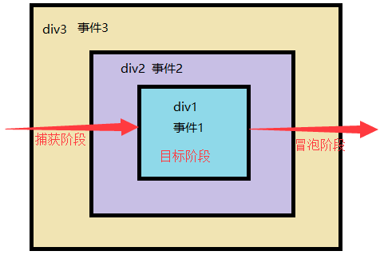

# 浏览器 API

**API**（Application Programming Interface,应用程序编程接口）是一些预先定义的函数，目的是提供应用程序与开发人员基于某软件或硬件得以访问一组例程的能力

浏览器 API 提供了三种类型：**浏览器操控类(BOM)、页面文档操控类(DOM)、网络控制类**

> 浏览器提供的 API 并不只有这三类，还有文档对象模型、设备 API、通信 API、数据管理 API、特权 API、已认证应用程序的私有 API

## 文档对象模型 (DOM)

DOM(Document Object Model)：JavaScript 操作网页的接口。

将网页转为一个**JavaScript 对象**，从而可以用脚本进行各种操作(增删改查)

浏览器会根据 DOM 模型，将结构化文档(比如 HTML 和 XML)解析成一系列的节点， 再由这些节点组成一个**树状结构(DOM Tree)**。

所有的节点和最终的树状结构，都有规范的对外接口。


### 节点

节点（node）：DOM 的最小组成单位

**顶层**：docoment 节点，文档根节点（window.docoment）

**父节点关系(parentNode)**：直接的那个上级节点

**子节点关系(childNodes)**：直接的下级节点

**同级节点关系(sibling)**：拥有同一个父节点的节点

### 查找节点

|             方法             | 关键   |                                     详情                                      |
| :--------------------------: | ------ | :---------------------------------------------------------------------------: |
|  **getElementsByTagName()**  | 标签   |                            返回指定 HTML 标签元素                             |
| **getElementsByClassName()** | 类     |                           返回 class 符合条件的元素                           |
|   **getElementsByName()**    | 名称   |                         返回有 name 属性的 HTML 元素                          |
|     **getElementById()**     | id     |               返回匹配指定 id 属性的元素节点，id 相同，选第一个               |
|     **querySelector()**      | 选择器 | 返回匹配该选择器的元素节点； <br>多个节点满足条件，则返回**第一个匹配节点**。 |
|    **querySelectorAll()**    |        |                  与 querySelector 用法类似，返回**多个节点**                  |

返回值：除了`querySelector`外，都返回类似数组的 HTMLCollection 对象

querySelector()、querySelectorAll()

- 多个参数值，使用`,`隔开
- 支持复杂的 CSS 选择器
- 不支持伪类和伪元素选择器

## 事件

一种 触发—响应 的机制：**用户的行为** + **浏览器感知（捕获）到用户的行为** + **事件处理程序**

**事件三要素**

- **事件源**：(被)触发事件的元素
- **事件类型**：事件的触发方式(例如鼠标点击或键盘点击)
- **事件处理程序**：事件触发后要执行的代码(函数形式)

### 事件绑定

#### 行内方式绑定元素

onclick 是 html 属性，属性值为可执行代码

```js
<input type="button" value="按钮" id="btn" onclick="alert(1)">
<input type="button" value="按钮" id="btn" onclick="f()">
<script>
  function f(){
    console.log(this);//this-> window对象
  }
</script>
```

#### 动态绑定 (节点对象属性)

获取节点对象的属性 onclick 值，值为匿名函数

**缺点**：同一元素同一事件**只能定义一次**，定义两次，后一次会覆盖前一次

```javascript
document.getElementById('btn').onclick = function () {
  console.log(this) //this -> 选中对象 - document.getElementById('btn')
}
```

#### 事件监听(节点对象方法)

每个节点对象提供了 addEventListener 方法，给选中节点添加指定类型的事件及事件处理程序

**特点**：可针对同一元素同一事件，**添加多个监听事件**，按序执行

```javascript
document.getElementById('btn').addEventListener('click', function () {
  console.log(this) //选中对象
})
```

### 移除事件监听

`removeEventListener`移除监听函数，必须与对应`addEventListener`方法**参数完全一致**

```javascript
function f() {
  alert(1)
}
var btn = document.getElementById('btn')
btn.addEventListener('click', f)
btn.removeEventListener('click', f)
```

### 事件类型

**事件类型**：https://developer.mozilla.org/zh-CN/docs/Web/Events

|        事件名称        |                     何时触发                      |
| :--------------------: | :-----------------------------------------------: |
| **页面事件(资源事件)** |                                                   |
|         `load`         |            资源及其相关资源已完成加载             |
|         unload         |                    正在被卸载                     |
|         error          |                     加载失败                      |
|         resize         |                   调整窗口大小                    |
|      **焦点事件**      |                                                   |
|         focus          |                   元素获得焦点                    |
|          blur          |                   元素失去焦点                    |
|      **鼠标事件**      |                                                   |
|       mouseenter       |                指针**移到元素内**                 |
|       mouseleave       |                指针移出元素范围外                 |
|      `mouseover`       |         指针**移到元素或者它的子元素内**          |
|        mouseout        |        指针移出元素，或者移到它的子元素上         |
|       mousemove        |          指针在元素内**移动时**持续触发           |
|       mousedown        |                 按下任意鼠标按钮                  |
|        mouseup         |                 释放任意鼠标按键                  |
|         click          |              按下并释放任意鼠标按键               |
|        dbclick         |                   双击鼠标按钮                    |
|     `contextmenu`      |            右键点击 (右键菜单显示前).             |
|        `select`        |      文本被选中（input 标签、textarea 标签）      |
|         `copy`         |                 元素内容被拷贝时                  |
|      **键盘事件**      |                                                   |
|        keydown         |                   按下任意按键                    |
|        keypress        | 除 Shift, Fn, CapsLock 外任意键被按住. (连续触发) |
|         keyup          |                   释放任意按键                    |
|   **form 表单事件**    |                                                   |
|         reset          |                   点击重置按钮                    |
|         submit         |                   点击提交按钮                    |
|    **内容变化事件**    |                                                   |
|         change         |     内容**改变且失去焦点**时触发 （存储事件）     |
|         input          |         **内容改变**时触发 （值变化事件）         |

**下述事件不会冒泡**

abort(音视频终止加载)，resize，error，load，unload，mouseenter，mouseleave，blur，focus

### 事件的传播

当点击 div1 时，触发 事件 1，但是，紧跟着，事件 2 和事件 3 也被触发了。这种现象是**事件冒泡**


JS 中事件发生后，会在不同 DOM 节点之间传播

#### 三个阶段

事件传播三个阶段：捕获 => 目标 => 冒泡

**捕获阶段**：从 window 对象传导到目标节点

**目标阶段**：目标节点上触发

**冒泡阶段**：从目标节点传回 window 对象



传播顺序：

- 捕获阶段：window、document、html、body、div；
- 冒泡阶段：div、body、html、document、window。

> **注意：** 三种事件绑定方式监听冒泡阶段事件（默认）

### 改变事件触发阶段

```javascript
addEventListener(
  'click',
  function () {
    alert('事件冒泡')
  },
  false
) //默认会发生事件冒泡
addEventListener(
  'click',
  function () {
    alert('捕获阶段触发')
  },
  true
)
```

## 事件对象

**事件处理函数**：事件触发为用户行为，无法确定时间。事件触发，会调用事件处理函数。

**事件对象**：事件触发，信息封装成一个对象传递给处理函数。

> W3C 浏览器：e
>
> IE 浏览器：window.event

### 常用属性

**event.bubbles**:返回布尔值，表示当前事件是否会**冒泡**
**event.eventPhase**：返回整数值，表示事件流在**传播**阶段的位置

- 0：未发生
- 1：捕获阶段
- 2：目标阶段
- 3：冒泡

**event.type**:返回字符串，表示**事件类型**，大小写敏感

**event.timeStamp**:返回毫秒时间戳，表示**事件发生的时间**

**clientX、clientY** :获取鼠标事件触发的坐标

### ==事件代理/委托==

**event.target**：对事件起源目标的引用，属性返回**触发事件节点**

> 可能是绑定事件的那个标签，也可以是绑定事件的标签的子标签

**event.currentTarget**：返回**事件当前所在节点**，即正在执行的监听函数所绑定的那个节点

**事件代理/事件委托**：由于事件会在冒泡阶段向上传播到父节点，可以把子节点的监听函数定义在父
节点上，由父节点的监听函数统一处理多个子元素的事件。

```html
<ul>
  <li>1</li>
  <li>2</li>
  <li>3</li>
</ul>
<script>
  let ul = document.querySelector('ul')
  ul.addEventListener('click', function (evt) {
    console.log(evt.target.innerText)
  })
</script>
```

### 阻止浏览器默认行为&阻止事件传播

**event.preventDefault()**：阻止浏览器对当前事件的默认行为（表单提交，跳转 etc）

> 监听函数内 return false，也可以阻止默认事件

**event.stopPropagation()**：阻止事件冒泡，防止触发定义在别的节点上的监听函数

## 节点操作

### 节点操作

|           节点操作            |                            参数                            |                       作用                       |
| :---------------------------: | :--------------------------------------------------------: | :----------------------------------------------: |
| **document.createElement()**  |                         元素标签名                         |                     创建标签                     |
| **document.createTextNode()** |                        文本节点内容                        |                   创建文本节点                   |
|    **node.appendChild()**     |                          节点对象                          |     将其作为最后一个子节点，**插入当前节点**     |
|   **node.hasChildNodes()**    |                          节点对象                          |               当前节点是否有子节点               |
|    **node.removeChild()**     |                          节点对象                          |               当前节点移除该子节点               |
|     **node.cloneNode()**      | **true**：标签本身及内容<br /> **false**：标签本身（默认） |         克隆选中的节点，**不会克隆事件**         |
| `node.replaceChild(new,old)`  |                     newChild,oldChild                      | 点替换当前节点的一个子节点，并返回被替换掉的节点 |
|       **获取标签内容**        |                                                            |                                                  |
|      **node.innerHTML**       |                                                            |    该元素包含标签及内容，不属于 W3C DOM 规范     |
|      **node.innerText**       |                                                            |                 该元素包含的内容                 |

### 节点属性

#### 原生属性

HTML 元素节点的**标准属性**（即在标准中定义的属性），会**自动成为元素节点对象的属性**

```
node.id - > 获取id属性
node.class - > 获取类名
```

#### 属性操作

**node.getAttribute()**：获取元素属性。不存在，返回 null

**node.setAttribute()**：设置元素属性。属性存在，修改。不存在，添加

**node.hasAttribute()**：是否存在元素属性

**node.removeAttribute()**：移除元素属性

### 层级操作

|            层级操作             | 关键                         |                                                       |     |
| :-----------------------------: | ---------------------------- | :---------------------------------------------------: | --- |
|   **node.nextElementSibling**   | 节点后，第一个同级           |       **节点后**第一个同级节点。没有，返回 null       |     |
| **node.previousElementSibling** | 节点前，第一个同级           |               **节点前**第一个同级节点                |     |
|     **node.parentElement**      | 父级                         |                   节点**父级节点**                    |     |
|       **node.childNodes**       | 所有子节点                   | 当前节点**所有子节点**。同上（ **注意空格回车也算**） |     |
|       **node.firstChild**       | 第一个子节点                 |               返回节点**第一个子节点**                |     |
|       **node.lastChild**        | 最后一个子节点               |              返回节点**最后一个子节点**               |     |
|   **node.firstElementChild**    | 第一个子节点（不含空格换行） |        返回节点**第一个子节点**不包含空格换行         |     |

### CSS 样式操作

每个**DOM 对象都有 style 属性**

- **名字需要改写** `background-color -> backgroundColor`
- 属性值都是字符串，**设置必须包括单位**
- 获取 CSS 样式，均是行内样式，style 中样式无法修改获取，但是可以覆盖

> 不设值为获取，设值为赋值

**getComputedStyle**：window 下方法，接受一个节点对象，返回该节点**对象最终样式信息**（样式叠加后结果）

- element：元素
- pseudoElt（可选）：伪元素，普通元素省略或 null

```js
let style = window.getComputedStyle(element, [pseudoElt])
```

### 其他

**document.documentURI** ：返回文档的  URL。

**nodeType**：https://developer.mozilla.org/zh-CN/docs/Web/API/Node/nodeType

## 浏览器对象模型（BOM）

浏览器对象模型(Browser Object Model)，提供了独立于内容的、可以与浏览器窗口进行互动的对象结构。

浏览器对象具体实例化对象：`window`

### window 对象

https://developer.mozilla.org/zh-CN/docs/Web/API/Window

#### 对话框

**window.alert()**：一个警告对话框,上面显示有指定的文本内容以及一个"确定"按钮。

**window.prompt()**：一个对话框,对话框中包含一条文字信息,用来提示用户输入文字。返回值：输入内容

**window.confirm()**：方法显示一个具有一个可选消息和两个按钮(确定和取消)的模态对话框  。返回值：true or false

#### 页面加载事件

当页面完全加载所有内容（包括图像、脚本文件、CSS 文件等）后执行

```javascript
window.onload = function () {}
```

> 页面只能出现一次，写多个使用事件监听方式 addEventListener

#### 浏览器控制台

**window.console** : 返回 console 对象的引用，提供了对浏览器调试控制台的访问

**console.clear()** : 清空控制台。

**console.error()** : 打印错误信息

**console.table()** : 表格形式打印（数组，对象）

**console.log()** ： 打印日志

#### 定时器

#### setTimeout()，clearTimeout()

到达给定的时间之后执行指定的函数，**只执行一次**

```javascript
// 创建一个定时器，1000毫秒后执行，返回定时器的编号
var timerId = window.setTimeout(function () {
  console.log('Hello World');
}, 1000);
// 清除定时器，传入编号
window.clearTimeout(timerId);
//字符串格式的函数的调用
function(str){
    console.log(str);
}
var test = 'hello'
setTimeOut('f(test)',1000);
```

#### setInterval()和 clearInterval()

到达给定的时间后**周期调用函数**(单位毫秒)

```javascript
// 创建一个定时器，每隔1秒调用一次
var timerId = window.setInterval(function () {
  var date = new Date()
  console.log(date.toLocaleTimeString())
}, 1000)
window.clearInterval(timerId)
```

### location 对象

https://developer.mozilla.org/zh-CN/docs/Web/API/Location

**window.location**  只读属性，返回一个   **Location**对象，其中包含有关文档当前位置的信息

**URL**：统一资源定位符 (Uniform Resource Locator）

`scheme://host:port/path?query#fragment`

- **scheme**：通信协议，常用的 http,ftp,maito 等
- **host**：主机，服务器、域名系统、主机名或 IP 地址
- **port**：端口号（可选）。http 默认端口为 80
- **path**：路径。由零或多个'/'符号隔开的字符串，表示主机的目录或文件地址
- **query**：查询（可选）。给动态网页传递参数，可有多个参数，用`&`符号隔开，参数名和值用`=`符号隔开
- **fragment**：信息片断。字符串，锚点

**页面跳转**：`location.href='#'`

**location.reload()**

- **true**：刷新页面本身
- **false**：强制刷新，加载的静态资源文件也会刷新（默认）

### history 对象

https://developer.mozilla.org/zh-CN/docs/Web/API/History

**history.back()** ：浏览器记录中 前往上一页

**history.forward()** ：浏览器记录中前往下一页

**history.go()** : 通过当前页面相对位置从浏览器历史记录加载页面 eg：-1：上一页，1：下一页.

### navigator 对象

https://developer.mozilla.org/zh-CN/docs/Web/API/Navigator

**常用属性**

**userAgent** : 判断用户浏览器的类型

**platform** : 判断系统平台类型

**geolocation** : 位置定位对象

**webAPI**：https://developer.mozilla.org/zh-CN/docs/Web/Reference/API
