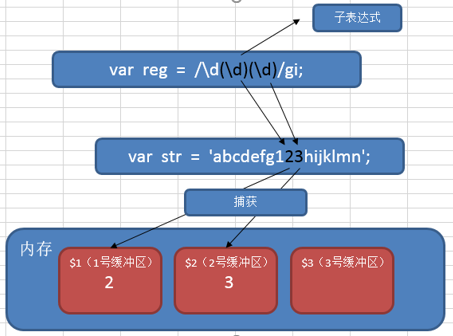

# 正则表达式

**正则表达式**：对字符串操作的一种逻辑公式，就是用事先定义好的一些特定字符、及这些特定字符的组合，组成一个“规则字符串”，这个“规则字符串”用来对字符串的进行匹配。

用途

- 检查一个字符串中是否含有某种子串
- 将匹配的某种子串做替换
- 从某个字符串中取出符合某个条件的子串

应用

- 表单验证，验证字符的合法性，如邮箱是否合法，手机号是否合法等等。
- 信息过滤，如论坛帖子或者评论中的非法字符，例如 sql 注入、js 脚本注入、煽动性的言论
- 信息采集，采集别人网站上面的内容，例如整页采集时 筛选出需求的部分
- 信息替换
- 页面伪静态的规则（url 重写）

## 正则语法-元字符

**元字符**：一些具有特殊含义的特殊符号

**普通字符**：所有大写和小写字母、所有数字、所有标点符号和一些其他符号

**正则表达式三步走**

- 匹配符（查什么）（等价符，字符簇，修饰符，转义符）
- 限定符（查多少）
- 定位符（从哪查）

### 限定符

限定符（量词）：指定正则表达式的一个给定组件必须出现多少次才能满足匹配

|    #    |        说明        |          举例           | 等价写法 |
| :-----: | :----------------: | :---------------------: | :------: |
|   \*    |     0 次或多次     |      zo\*<br>z zoo      |  `{0,}`  |
|    +    |     1 次或多次     |      zo+<br>zo zoo      |  `{1,}`  |
|    ?    |    0 次或 1 次     | do(es)?<br>do doxy does | `{0,1}`  |
|  `{n}`  |        n 次        |      o{2}<br>food       |          |
| `{n,}`  |     至少 n 次      |     o{2,}<br>fooood     |          |
| `{n,m}` | 最少 n 次最多 m 次 |     o{1,3}<br>fooo      |          |

> n,m 非负整数 n<=m，逗号和 n，m 之间不能有空格

**贪婪匹配**：尽可能去多的情况（默认）

**非贪婪匹配**：？加在其他限定符之后，应用：匹配 div

### 等价符

|  #  |                        说明                         |    等价写法     |
| :-: | :-------------------------------------------------: | :-------------: |
|  .  | 匹配除换行符之外的任何单个字符<br>匹配'\n'，(.\|\n) |                 |
| \d  |                      数字字符                       |     `[0-9]`     |
| \D  |                     非数字字符                      |    `[^0-9]`     |
| \w  |                 字母、数字、下划线                  |  `[A-Za-z0-9]`  |
| \W  |                非字母、数字、下划线                 | `[^a-za-z0-9]`  |
| \s  |       任何空白字符（空格、制表符、换页符等）        | `[\f\n\r\t\v]`  |
| \S  |      非任何空白字符（空格、制表符、换页符等）       | `[^\f\n\r\t\v]` |
| \n  |                       换行符                        |   \x0a 和 \cJ   |
| \r  |                       回车符                        |   \x0d 和 \cM   |
| \t  |                       制表符                        |   \x09 和 \cl   |

### 定位符

|  #  |             说明             |
| :-: | :--------------------------: |
|  ^  |        字符串开始位置        |
|  $  |        字符串结束位置        |
| \b  | 单词边界（单词和空格间位置） |
| \B  |          非单词边界          |

> 设置 RegExp 对象的 Multiline 属性，**$和^** 还会与 **\n 或 \r** 匹配。

### 字符簇

**字符簇**：匹配满足条件的一个字符。`[]`

|   #    |                 说明                 |                    举例                     |
| :----: | :----------------------------------: | :-----------------------------------------: |
| [xyz]  |      字符集合，所包含的任意字符      |             [abc]<br>plain -> a             |
| [^xyz] |    负值字符集合，未包含的任意字符    |         [^abc]<br>plain -> p,l,i,n          |
| [a-z]  |     字符范围，指定范围内任意字符     |                                             |
| [^a-z] | 负字符范围，不在指定范围内的任意字符 |                                             |
|  x\|y  |           或，匹配 x 或 y            | z\|food<br>z food<br>(z\|f)ood<br>zood food |

[0-9] 查找任何从 0 至 9 的一个数字

[a-z] 查找任何从小写 a 到小写 z 的字符。

[A-Z] 查找任何从大写 A 到大写 Z 的字符。

[A-z] 查找任何从大写 A 到小写 z 的字符。包括 [ \ ]^\_` 等六个字符

[A-Za-z]查找任何从大写 A 到小写 z 的字符，不包括 [ \ ]^\_` 等六个字符

### 修饰符

修饰符写在**正则表达式末尾/之后**，可以一次性使用多个修饰符

|   #   |                 说明                 |
| :---: | :----------------------------------: |
| **i** |  大小写**不敏感**（默认区分大小写）  |
| **g** |             **全局**匹配             |
| **m** | **多行**匹配（^$匹配每行开始和结束） |

### 转义字符

|  #  |           说明           |
| :-: | :----------------------: |
| \   | 将下一个字符标记为转义符 |

> `[]$.*?+|^{}()`需要加转义字符

## js 中正则对象

### 正则对象两种定义方式

```js
var pattern = /[a-z]/ //将正则表达式直接当做对象使用。
var pattern = new RegExp(/[a-z]/) //实例化RegExp对象
```

### test 方法

检测目标字符串和正则表达式是否匹配。匹配返回 true，不匹配返回 false

### exec 方法

执行一个正则匹配，只匹配一次。匹配返回数组类型结果，不匹配 null

- 即使使用了全局匹配修饰符 g，也匹配一次
- 但是多次执行，下一次执行从上一次匹配结束位置开始

### lastIndex 属性

上一次匹配结束的位置，即下一次匹配开始的位置

- 没有更多匹配（全局修饰）lastIndex 重置为 0
- test 和 exec 方法默认匹配一次，匹配后 lastIndex 重置为 0
- 使用了全局修饰符 g，lastIndex 不会重置为 0

```js
var str = 'php1js22'
//var pattern = /[a-z]/;//匹配小写字母字符串
var pattern = /[a-z]/g //全局匹配小写字母字符串
var res1 = pattern.exec(str)
console.log(res1) //["p"] 只匹配一次，返回数组
console.log(pattern.lastIndex) //1  下一次匹配开始的位置
var res2 = pattern.exec(str)
console.log(res2) //["h"] //从位置1开始匹配
```

## String 对象的正则方法

### match 方法

**stringObj.match(regex)**：在字符串中检索匹配正则表达式 regex 的子串；

匹配，返回包含匹配结果的一个数组；不匹配返回 null

- 不带全局修饰符 g，则只匹配一次
- 带全局修饰符 g，则匹配所有结果

### replace 方法

**stringObj.replace(regex, replacement)**：在字符串中检索匹配正则表达式 regex 的子串，并替换为指定的字符串 replacement；

- 同 match

> $1：表匹配第一个子表达式
>
> $2：第二个子表达式，以此类推

### search 方法

**stringObj.search(regex)**：在字符串中搜索符合正则表达式的结果。

找到结果返回结果的起始位置，停止向后检索；如果没有匹配结果，返回-1.

**忽略全局标识符 g**

### split 方法

**stringObj.split(regex)**：把一个字符串分割成字符串数组, 返回一个数组

## 分组/捕获和反向引用

**捕获和反向引用的语法的解释**：

**子表达式**
在正则表达式中，通过一对圆括号括起来的内容，我们就称之为“子表达式”。如：
`var reg = /\d(\d)\d/gi;`

**捕获**（分组）

在正则表达式中，子表达式匹配到相应的内容时，系统会自动捕获这个行为，

然后将子表达式匹配到的内容放入系统的缓存区中。我们把这个过程就称之为“捕获”。


**反向引用**
在正则表达式中，我们可以使用\n（n>0，正整数，代表系统中的缓冲区编号）
来获取缓冲区中的内容，我们把这个过程就称之为“反向引用”。


在正则语法中，用“\1”来引用前面的捕获（使用子表达式匹配的结果）。用\2 表示第二个捕获的内容….

在正则语法外（如 replace 时），用“$1”来引用前面的捕获。

```javascript
var str = '1122 3434 5566 7879 9887'
//匹配连续四个数字，第一和第二数字相同，第三和第四数字相同
var res = str.match(/(\d)\1(\d)\2/g)
console.log(res)
//匹配连续四个数字，第一和第三数字相同，第二和第四数字相同
var res = str.match(/(\d)(\d)\1\2/g)
console.log(res)
//匹配连续四个数字，第一和第三数字相同
var res = str.match(/(\d)\d\1\d/g)
console.log(res)
//匹配连续四个数字，第一和第二数字相同，第三和第四数字相同，并将相同的数字只保留一个
var res = str.replace(/(\d)\1(\d)\2/g, '$1$2')
console.log(res)
```

禁止引用

(?:正则)： 这个小括号中的内容不能够被引用

```javascript
var str = '1122 3434 5566 7879 9887'
var res = str.match(/(?:\d)(\d)\1\d/g)
console.log(res) //9887
```

## 环视

正则表达式中，用于**查找某些内容之前或者之后的东西**，叫做环视。

环视通常也叫做预查、断言或者零宽断言。

### 正向肯定预查

也叫 顺序肯定环视

every(?=n) 匹配任何**其后紧接**指定字符串 n 的字符串。

```javascript
//匹配后面字符为10的win
var str = 'win7 win8 win10'
var res = str.match(/win(?=10)/g)
console.log(res) //["win"]
```

### 正向否定预查

也叫 顺序否定环视

every(?!n) 匹配任何其后没有紧接指定字符串 n 的字符串。

```javascript
//匹配后面字符不为10的win
var str = 'win7 win8 win10'
var res = str.match(/win(?!10)/g)
console.log(res) //["win", "win"]
```

(?!B)[A-Z]这种写法，其实它是[A-Z]范围里，排除 B 的意思，前置的(?!B)只是对后面数据的一个限定，从而达到过滤匹配的效果。

```javascript
var str = 'abcd1234'
var res = str.match(/(?!c)[a-z]/g)
console.log(res) //["a", "b", "d"]
//匹配非c字符
```

练习：从一堆图片地址中，找出符合条件的图片地址。

```javascript
var arr = ['img/20181013/a.jpg', 'img/20181014/b.png', 'image/20181014/a.jpg', 'image/20181013/b.png', '20181013/c.png']
```

匹配 img 开头的图片地址

```javascript
;/^img.*(jpg|png|gif)$/g
```

匹配不以 image 开头的图片地址

```javascript
;/^(?!image).*(jpg|png|gif)$/
```


## 应用

### 科学计数法

```js
;/\d(?:\.(\d*))?e([+-]\d+)/
// \d 科学计数法首位
// (?:\.(\d*))? - ?:取消外层捕获， (\d*):捕获小数点后数字
// ([+-]\d+) - 捕获e之后数字
```

### 检测手机号格式

手机号特点：11 位，纯数字，1 开头， [23 位号段，具体咨询各大运营商]

简单版（限制前两位）：1 开头，第二位 3-9，后面 9 位数字

```javascript
;/^1[3-9]\d{9}$/
```

精确版（限制前三位）：（如果出现新的手机号段，则不适用，需更新）

示例：

13[0-9]开头、14[579]开头、15[0-3,5-9]开头、166 开头、17[0135678]开头、18[0-9]开头、19[89]开头

```javascript
;/^1(3[0-9]|4[579]|5[0-3,5-9]|6[6]|7[0135678]|8[0-9]|9[89])\d{8}$/
```

### 检测邮箱格式

邮箱特点：

2342.3s_-df@sina.com.cn

通用的邮箱的特点：

简单版：必须有@ 正则 /@/

```js
var pattern = /@/
```

精确版：

    必须有@和.

    @前面是邮箱名，要求至少一个字符，要求是数字、字母、下划线、[还可以用.-]，但是开头必须是数字字母下划线

    @和点之间：是一个域名，要求至少一个字符，可以是数字字母中横线，要求开头是数字或字母

    点后面：要求是至少一个字符，必须是字母

    点xxx，这部分可以出现一次，也可以出现多次

最后一个点后面，字符长度为 2-6 的字母

```javascript
var pattern = /^\w[\w\.-]*@[0-9a-z][0-9a-z-]*(\.[a-z]+)*\.[a-z]{2,6}$/i
```

### 结巴问题

匹配重复字符，保留一个

```js
var str = '今今今天晚晚晚晚晚晚上吃吃吃吃吃吃鸡'
//今天晚上吃鸡
var res = str.replace(/([\u4E00-\u9FA5])\1+/g, '$1')
console.log(res)
```

### 括号取值转点取值

对象括号取值转为点取值

```
regexp：\['(.+?)'\]
replace：.$1
```

```
test["a"] => test.a
```

### 标题降级或升级

将 ## => # ，二级标题转一级标题

```
search：^##([^#])
replace：#$1
```

```js
## => #
```

### 匹配中文

```
[\u4E00-\u9FA5]
```

**完整的 Unicode 编码表**：http://blog.csdn.net/hherima/article/details/9045861
